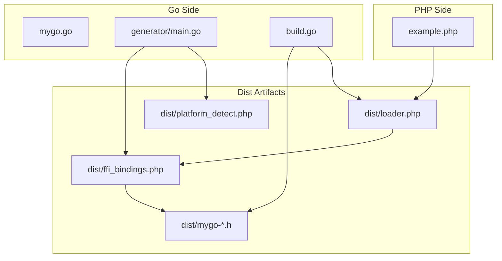
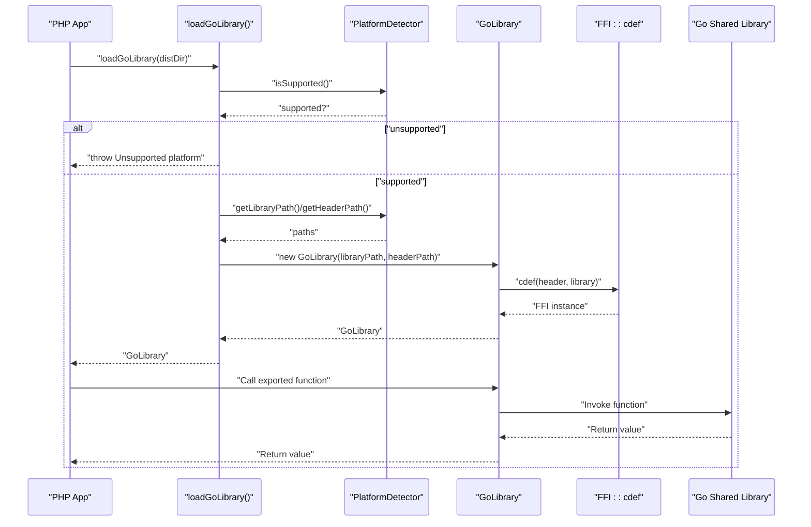
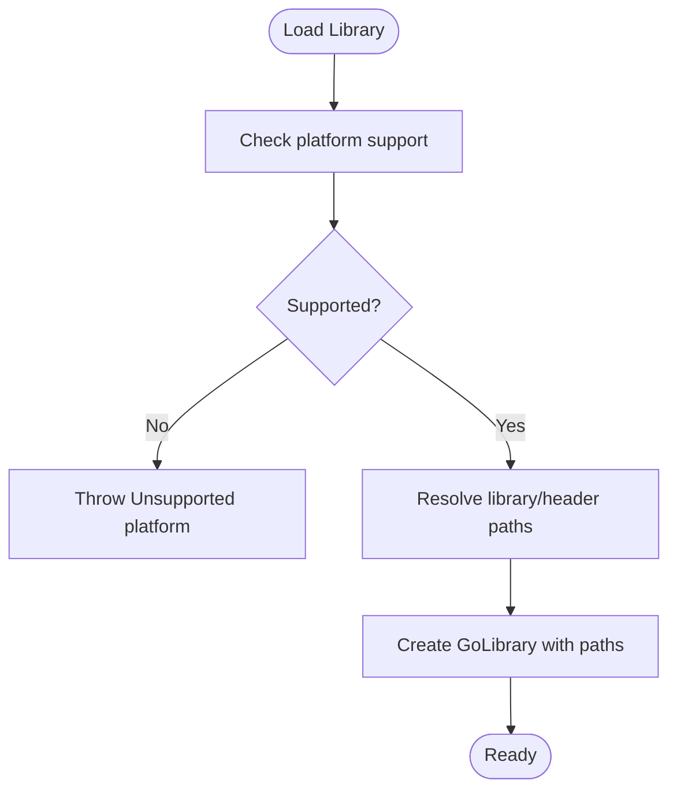
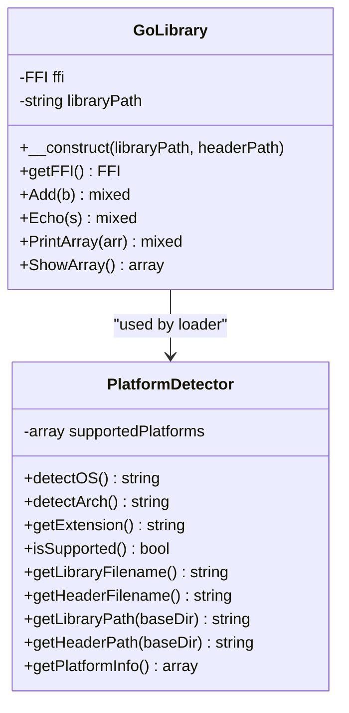
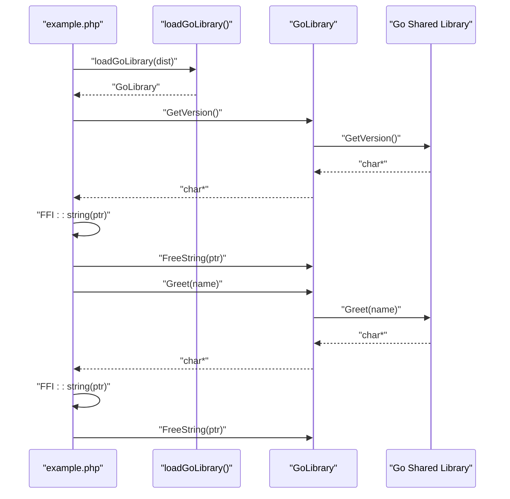
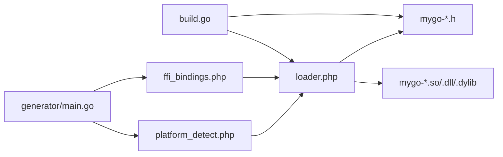

# PHP FFI Problems

<cite>
**Referenced Files in This Document**
- [README.md](file://README.md)
- [AGENTS.MD](file://AGENTS.MD)
- [example.php](file://example.php)
- [dist/loader.php](file://dist/loader.php)
- [dist/ffi_bindings.php](file://dist/ffi_bindings.php)
- [dist/platform_detect.php](file://dist/platform_detect.php)
- [dist/mygo-windows-amd64-v2.h](file://dist/mygo-windows-amd64-v2.h)
- [build.go](file://build.go)
- [mygo.go](file://mygo.go)
</cite>

## Table of Contents
1. [Introduction](#introduction)
2. [Project Structure](#project-structure)
3. [Core Components](#core-components)
4. [Architecture Overview](#architecture-overview)
5. [Detailed Component Analysis](#detailed-component-analysis)
6. [Dependency Analysis](#dependency-analysis)
7. [Performance Considerations](#performance-considerations)
8. [Troubleshooting Guide](#troubleshooting-guide)
9. [Conclusion](#conclusion)

## Introduction
This document focuses on common PHP FFI runtime issues when using the serviceLib build system. It covers:
- Ensuring the FFI extension is enabled
- Proper string handling and avoiding memory leaks
- Type conversion pitfalls between Go and PHP
- Diagnosing FFI access violations and segmentation faults
- Debugging techniques using PHP error logs and FFI context inspection
- Correct usage patterns and configuration requirements referenced from the project’s documentation

The guidance is grounded in the repository’s official documentation and generated artifacts to ensure accurate, actionable steps.

## Project Structure
The repository provides a complete build system for generating Go shared libraries consumable by PHP via FFI, including:
- A generator that produces PHP FFI bindings from Go exported functions
- A cross-platform build orchestrator
- Runtime loader and platform detection utilities
- Example usage and troubleshooting guidance

**Diagram sources**
- [mygo.go](file://mygo.go#L1-L39)
- [build.go](file://build.go#L1-L183)
- [dist/loader.php](file://dist/loader.php#L1-L58)
- [dist/ffi_bindings.php](file://dist/ffi_bindings.php#L1-L89)
- [dist/platform_detect.php](file://dist/platform_detect.php#L1-L146)
- [example.php](file://example.php#L1-L95)

**Section sources**
- [README.md](file://README.md#L1-L120)
- [AGENTS.MD](file://AGENTS.MD#L1-L120)

## Core Components
- Platform detection and loader: Automatically detects OS/architecture and loads the correct shared library and header.
- FFI bindings: Wraps exported Go functions behind typed PHP methods and exposes a raw FFI handle for advanced scenarios.
- Example usage: Demonstrates correct string handling and memory management.

Key responsibilities:
- Loader validates platform support and throws explicit errors for unsupported environments.
- FFI bindings enforce that the FFI extension is loaded and that library/header files exist.
- Example code shows correct usage of FFI::string and FreeString to avoid leaks.

**Section sources**
- [dist/loader.php](file://dist/loader.php#L1-L58)
- [dist/ffi_bindings.php](file://dist/ffi_bindings.php#L1-L89)
- [dist/platform_detect.php](file://dist/platform_detect.php#L1-L146)
- [example.php](file://example.php#L1-L95)

## Architecture Overview
The runtime architecture ties together platform detection, library loading, and FFI invocation.

**Diagram sources**
- [dist/loader.php](file://dist/loader.php#L1-L58)
- [dist/platform_detect.php](file://dist/platform_detect.php#L1-L146)
- [dist/ffi_bindings.php](file://dist/ffi_bindings.php#L1-L89)

## Detailed Component Analysis

### Platform Detection and Loader
- Purpose: Detect OS/architecture, resolve platform-specific filenames, and load the library and header.
- Behavior: Throws explicit exceptions for unsupported platforms or missing files.
- Usage: The loader function returns a GoLibrary instance ready to call exported functions.

**Section sources**
- [dist/loader.php](file://dist/loader.php#L1-L58)
- [dist/platform_detect.php](file://dist/platform_detect.php#L1-L146)

### FFI Bindings and Type Mapping
- Purpose: Provide a typed PHP interface to Go functions and expose a raw FFI handle.
- Type mapping: The generator maps C/Go types to PHP built-in types (int, float, bool, string, array, void).
- Error handling: Validates FFI extension presence and file existence before loading.

**Diagram sources**
- [dist/ffi_bindings.php](file://dist/ffi_bindings.php#L1-L89)
- [dist/platform_detect.php](file://dist/platform_detect.php#L1-L146)

**Section sources**
- [dist/ffi_bindings.php](file://dist/ffi_bindings.php#L1-L89)
- [AGENTS.MD](file://AGENTS.MD#L298-L324)

### Example Usage and Memory Management
- Demonstrates correct string handling: convert C strings to PHP with FFI::string and free them with FreeString.
- Shows integer and boolean operations, and complex types returned as arrays.

**Diagram sources**
- [example.php](file://example.php#L1-L95)
- [dist/mygo-windows-amd64-v2.h](file://dist/mygo-windows-amd64-v2.h#L90-L111)

**Section sources**
- [example.php](file://example.php#L1-L95)
- [dist/mygo-windows-amd64-v2.h](file://dist/mygo-windows-amd64-v2.h#L90-L111)

## Dependency Analysis
- Loader depends on PlatformDetector and GoLibrary.
- GoLibrary depends on the FFI extension and on the availability of the shared library and header files.
- The generator depends on the Go source file containing exported functions and produces PHP files consumed by the loader.

**Diagram sources**
- [dist/loader.php](file://dist/loader.php#L1-L58)
- [dist/ffi_bindings.php](file://dist/ffi_bindings.php#L1-L89)
- [dist/platform_detect.php](file://dist/platform_detect.php#L1-L146)
- [build.go](file://build.go#L1-L183)

**Section sources**
- [build.go](file://build.go#L1-L183)
- [mygo.go](file://mygo.go#L1-L39)

## Performance Considerations
- Library loading occurs once per process; use persistent processes (e.g., PHP-FPM) to minimize repeated loads.
- FFI overhead is minimal compared to native C extensions.
- String conversion has overhead; batch operations when possible.
- Always free Go-allocated strings to prevent memory leaks.

**Section sources**
- [README.md](file://README.md#L296-L302)

## Troubleshooting Guide

### 1) FFI Extension Not Loaded
Symptoms:
- Explicit runtime exception indicating the FFI extension is not loaded.

Root cause:
- The FFI extension is disabled in php.ini.

Resolution:
- Enable the FFI extension and restart the web server or PHP-FPM.

Validation:
- The FFI bindings constructor checks for extension presence and throws a clear exception if absent.

**Section sources**
- [dist/ffi_bindings.php](file://dist/ffi_bindings.php#L1-L89)
- [README.md](file://README.md#L240-L251)

### 2) Library Not Found or Header Not Found
Symptoms:
- Exceptions stating the library or header file could not be found.

Root cause:
- Missing artifacts after generation/build or incorrect path passed to the loader.

Resolution:
- Ensure you ran the generator and built the library for your platform.
- Verify the dist directory contains the appropriate shared library and header file.
- Confirm the path passed to loadGoLibrary is correct.

**Section sources**
- [dist/ffi_bindings.php](file://dist/ffi_bindings.php#L1-L89)
- [README.md](file://README.md#L252-L260)

### 3) Unsupported Platform
Symptoms:
- Exception indicating the platform is unsupported.

Root cause:
- The detected OS/architecture is not supported by the loader.

Resolution:
- Build the library for your platform or extend the platform detection logic.

**Section sources**
- [dist/loader.php](file://dist/loader.php#L1-L58)
- [dist/platform_detect.php](file://dist/platform_detect.php#L1-L146)

### 4) CGO Not Enabled or Missing C Compiler
Symptoms:
- Build failures related to CGO or missing compilers.

Root cause:
- CGO is disabled or the required C compiler is not installed.

Resolution:
- Enable CGO and install the appropriate C compiler for your platform.

**Section sources**
- [README.md](file://README.md#L267-L278)

### 5) DLL Loading Error on Windows (Architecture Mismatch)
Symptoms:
- Errors indicating the DLL is not a valid Win32 application.

Root cause:
- Mismatch between the PHP architecture and the compiled DLL architecture.

Resolution:
- Ensure 64-bit PHP with 64-bit DLL (or 32-bit with 32-bit).
- Install required runtime libraries if indicated by the error.
- Temporarily adjust antivirus policies if necessary.

**Section sources**
- [README.md](file://README.md#L279-L295)

### 6) Memory Limit Exhaustion During FFI Operations
Symptoms:
- PHP memory exhaustion when processing large buffers or repeated string conversions.

Root cause:
- Excessive string conversions or large data transfers across the FFI boundary.

Resolution:
- Reduce the number of conversions by batching operations.
- Prefer numeric types where possible to minimize string overhead.
- Free C-allocated strings promptly to avoid leaks.

Evidence:
- The example demonstrates freeing strings returned by Go functions.

**Section sources**
- [example.php](file://example.php#L1-L95)
- [README.md](file://README.md#L300-L302)

### 7) Type Conversion Errors Between Go and PHP
Symptoms:
- Unexpected types or runtime errors when receiving complex types.

Root cause:
- Complex Go types (maps, slices, arrays) are mapped to PHP arrays; pointer types (non-char) are also mapped to arrays.

Resolution:
- Understand the type mapping and handle arrays accordingly in PHP.
- For strings, always convert via FFI::string and free with FreeString.

Mapping reference:
- Integer, float, bool, string, array, void are the supported PHP types for FFI-bound functions.

**Section sources**
- [AGENTS.MD](file://AGENTS.MD#L298-L324)
- [dist/ffi_bindings.php](file://dist/ffi_bindings.php#L1-L89)

### 8) String Handling and Memory Leaks
Symptoms:
- Memory growth over time or segmentation faults when strings are not freed.

Root cause:
- Returning C strings from Go without freeing them leads to leaks.

Resolution:
- Convert C strings to PHP strings using FFI::string.
- Immediately free the C string using the provided FreeString function.

Evidence:
- The header declares FreeString and the example shows proper usage.

**Section sources**
- [dist/mygo-windows-amd64-v2.h](file://dist/mygo-windows-amd64-v2.h#L90-L111)
- [example.php](file://example.php#L1-L95)
- [README.md](file://README.md#L204-L209)

### 9) FFI Access Violations and Segmentation Faults
Symptoms:
- Fatal errors or segmentation faults when calling functions.

Root cause:
- Passing invalid pointers, accessing freed memory, or mismatched types.

Resolution:
- Validate inputs before passing to Go functions.
- Ensure correct type mapping and avoid passing raw pointers as scalars.
- Inspect the FFI context and confirm the library is loaded successfully.

Diagnostic tips:
- Use PHP error logs to capture thrown exceptions from the loader and bindings.
- Inspect the platform information returned by the loader to confirm the correct library is being loaded.

**Section sources**
- [dist/loader.php](file://dist/loader.php#L1-L58)
- [dist/ffi_bindings.php](file://dist/ffi_bindings.php#L1-L89)
- [AGENTS.MD](file://AGENTS.MD#L326-L384)

### 10) Debugging Techniques
- Enable FFI extension and verify it is loaded.
- Capture stack traces from thrown exceptions in the loader and bindings.
- Log platform information to confirm the correct library and header are selected.
- Use FFI::string to inspect returned C strings and FreeString to release them.

**Section sources**
- [example.php](file://example.php#L1-L95)
- [dist/loader.php](file://dist/loader.php#L1-L58)

## Conclusion
By following the documented usage patterns and applying the troubleshooting steps above, you can reliably integrate Go shared libraries into PHP via FFI while avoiding common pitfalls such as missing extensions, incorrect platform detection, improper string handling, and memory-related crashes. The repository’s loader, bindings, and example provide a robust foundation for safe and efficient cross-language interoperability.