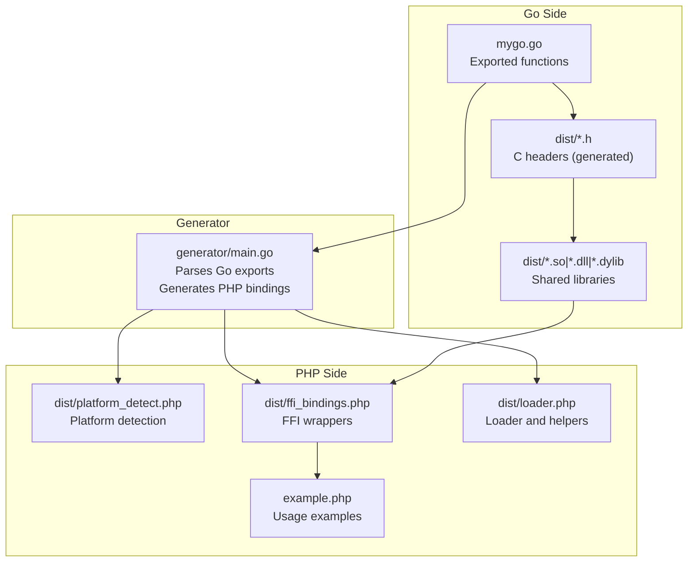
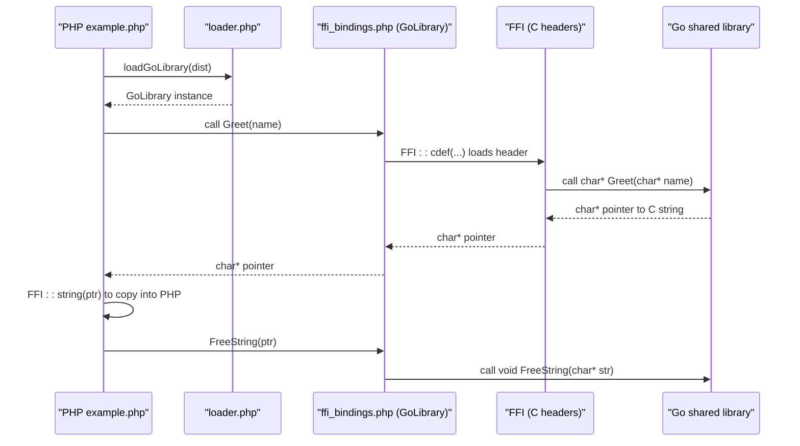
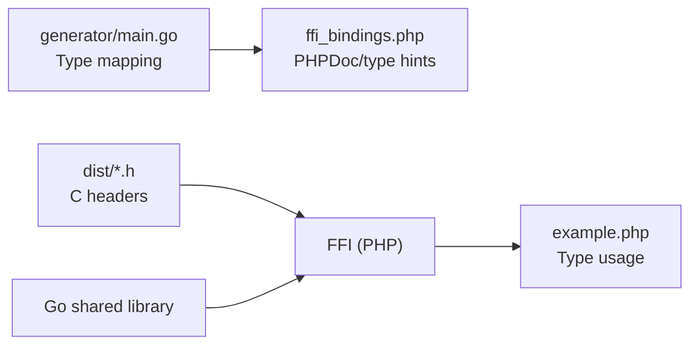

# Type Handling

<cite>
**Referenced Files in This Document**
- [AGENTS.MD](file://AGENTS.MD)
- [README.md](file://README.md)
- [generator/main.go](file://generator/main.go)
- [example.php](file://example.php)
- [mygo.go](file://mygo.go)
- [dist/mygo-windows-amd64-v2.h](file://dist/mygo-windows-amd64-v2.h)
</cite>

## Table of Contents
1. [Introduction](#introduction)
2. [Project Structure](#project-structure)
3. [Core Components](#core-components)
4. [Architecture Overview](#architecture-overview)
5. [Detailed Component Analysis](#detailed-component-analysis)
6. [Dependency Analysis](#dependency-analysis)
7. [Performance Considerations](#performance-considerations)
8. [Troubleshooting Guide](#troubleshooting-guide)
9. [Conclusion](#conclusion)

## Introduction
This document explains how type handling and conversion work between Go/C and PHP through FFI in this project. It focuses on the type mapping rules defined in the codebase, how the generator maps C/Go types to PHP types, and how to correctly use those mappings in practice. It also covers string handling nuances (null termination, encoding), common pitfalls, and guidance for debugging segmentation faults and access violations.

## Project Structure
The project consists of:
- A Go library with exported functions and CGO declarations
- A code generator that parses exported functions and produces PHP FFI bindings
- A build system that compiles shared libraries for multiple platforms
- Example PHP code demonstrating correct usage and type conversions
- Documentation that defines the complete type mapping table and best practices

**Diagram sources**
- [generator/main.go](file://generator/main.go#L1-L120)
- [dist/mygo-windows-amd64-v2.h](file://dist/mygo-windows-amd64-v2.h#L90-L118)
- [example.php](file://example.php#L1-L95)

**Section sources**
- [README.md](file://README.md#L25-L41)
- [AGENTS.MD](file://AGENTS.MD#L137-L160)

## Core Components
- Type mapping rules: The generator and documentation define how C/Go types are mapped to PHP types. These rules are enforced consistently across generated PHP bindings and documented in the type mapping table.
- PHP FFI bindings: The generator creates a GoLibrary class that wraps FFI calls, exposing typed methods to PHP.
- String handling: C strings returned from Go must be copied into PHP strings and freed by calling the provided FreeString function to avoid memory leaks.
- Arrays/maps/slices: Go maps, slices, arrays, and pointers (non-char) are mapped to PHP arrays.

**Section sources**
- [generator/main.go](file://generator/main.go#L481-L640)
- [AGENTS.MD](file://AGENTS.MD#L298-L323)
- [README.md](file://README.md#L195-L209)

## Architecture Overview
The type conversion pipeline:
- Go exports are parsed by the generator.
- The generator emits PHPDoc and method signatures based on C/Go types.
- The Go shared library exposes C-compatible functions with headers.
- PHP loads the library via FFI and invokes typed methods.
- Returned C strings are copied into PHP strings and must be freed.

**Diagram sources**
- [example.php](file://example.php#L54-L86)
- [dist/mygo-windows-amd64-v2.h](file://dist/mygo-windows-amd64-v2.h#L99-L111)
- [generator/main.go](file://generator/main.go#L341-L418)

## Detailed Component Analysis

### Type Mapping Rules
The project defines a comprehensive mapping from C/Go types to PHP types. The generator enforces these rules when generating PHPDoc and method signatures, and the documentation consolidates them in a single table.

Key mappings:
- Integers: All integer variants (including Go CGO types and C integer types) map to PHP int.
- Floats: All floating-point variants (including Go CGO float types and C float types) map to PHP float.
- Strings: C char pointers and Go strings map to PHP string; PHPDoc hints are applied accordingly.
- Booleans: All boolean variants map to PHP bool.
- Collections: Go maps, slices, arrays, and pointers (non-char) map to PHP array.
- Void: Functions returning void map to PHP void (no return type hint).

These rules are implemented in the generator’s type-to-PHP conversion functions and validated by the documentation’s type mapping table.

**Section sources**
- [generator/main.go](file://generator/main.go#L481-L640)
- [AGENTS.MD](file://AGENTS.MD#L298-L323)

### Generator Behavior and Type Conversion
The generator parses exported functions and converts their types to PHPDoc and method signatures:
- cTypeToPHPType: Used for PHPDoc comments; returns string, int, float, bool, array, void, or mixed for unknown types.
- cTypeToPHPDoc: Used for method return type hints; returns empty string for void and unknown types, otherwise returns the mapped PHP type.

It recognizes:
- String types: char*, *C.char, GoString, string
- Arrays/pointers: Go maps, slices, arrays, and pointers (excluding char)
- Integers: C and Go integer families
- Floats: C and Go float families
- Booleans: bool, GoBool, _Bool
- Void: void

This ensures generated PHP methods have accurate type hints and documentation.

**Section sources**
- [generator/main.go](file://generator/main.go#L481-L640)

### String Handling and Memory Management
- C strings returned from Go must be copied into PHP strings using FFI::string and then freed by calling the provided FreeString function.
- The header declares FreeString(char* str) and marks string-returning functions as requiring caller-side cleanup.
- The example demonstrates copying and freeing strings after use.

Common issues:
- Forgetting to free C strings leads to memory leaks.
- Passing unmanaged pointers or freed memory to FFI can cause crashes.

**Section sources**
- [dist/mygo-windows-amd64-v2.h](file://dist/mygo-windows-amd64-v2.h#L99-L111)
- [example.php](file://example.php#L54-L86)
- [AGENTS.MD](file://AGENTS.MD#L360-L370)
- [README.md](file://README.md#L120-L130)

### Arrays, Slices, and Maps
- Go maps, slices, arrays, and pointers (non-char) are mapped to PHP arrays.
- The generator recognizes GoMap, GoSlice, GoString, and GoInt/GoUint families, among others.
- Complex types like maps containing mixed values are represented as PHP arrays.

Practical guidance:
- Treat returned arrays as PHP arrays; iterate and access as usual.
- For pointer types (non-char), expect an array representation in PHP.

**Section sources**
- [generator/main.go](file://generator/main.go#L493-L501)
- [generator/main.go](file://generator/main.go#L570-L585)
- [AGENTS.MD](file://AGENTS.MD#L318-L321)

### Boolean Types
- bool, GoBool, and _Bool map to PHP bool.
- In the example, IsEven returns an integer-like value; PHP receives a bool-typed parameter, and the return is treated as a boolean in PHP.

**Section sources**
- [generator/main.go](file://generator/main.go#L544-L547)
- [example.php](file://example.php#L34-L53)

### Void Types
- Functions with void return types produce PHP methods without return type hints.
- The generator handles void by returning an empty string for PHPDoc hints.

**Section sources**
- [generator/main.go](file://generator/main.go#L549-L552)

### Example Usage in PHP
The example demonstrates:
- Loading the library and retrieving platform info
- Calling integer-returning functions
- Working with strings: obtaining pointers, copying with FFI::string, and freeing memory
- Verifying results and printing statuses

This shows correct usage patterns for type conversions and memory management.

**Section sources**
- [example.php](file://example.php#L1-L95)

## Dependency Analysis
The type handling depends on:
- The generator’s type mapping functions to produce accurate PHPDoc and method signatures
- The C headers to declare exported functions and their signatures
- The Go library to implement the functions and allocate C strings when needed
- PHP FFI to bridge Go/C and PHP

**Diagram sources**
- [generator/main.go](file://generator/main.go#L481-L640)
- [dist/mygo-windows-amd64-v2.h](file://dist/mygo-windows-amd64-v2.h#L90-L118)
- [example.php](file://example.php#L1-L95)

**Section sources**
- [generator/main.go](file://generator/main.go#L481-L640)
- [dist/mygo-windows-amd64-v2.h](file://dist/mygo-windows-amd64-v2.h#L90-L118)

## Performance Considerations
- Converting between PHP and C strings has overhead; batch operations when possible.
- Prefer passing primitive types (int, float, bool) over arrays for frequent calls.
- Avoid unnecessary repeated allocations and frees of C strings.

[No sources needed since this section provides general guidance]

## Troubleshooting Guide

### Type Conversion Errors
Symptoms:
- Unexpected type coercion or incorrect values
- Runtime warnings about incompatible types

Guidance:
- Ensure you pass the correct PHP types that match the mapped C/Go signatures.
- For strings, always pass PHP strings; the generator maps char* and GoString to PHP string.
- For arrays, pass PHP arrays for Go maps/slices/arrays; for pointers (non-char), pass PHP arrays.

**Section sources**
- [generator/main.go](file://generator/main.go#L481-L640)
- [AGENTS.MD](file://AGENTS.MD#L298-L323)

### String Handling Issues
Symptoms:
- Memory leaks
- Crashes when accessing freed memory
- Garbage or truncated strings

Guidance:
- Always copy C strings into PHP strings using FFI::string before freeing.
- Always call FreeString on pointers returned by Go string-returning functions.
- Ensure the C string is null-terminated; Go’s C.CBytes and C.CString produce null-terminated strings.

**Section sources**
- [example.php](file://example.php#L54-L86)
- [dist/mygo-windows-amd64-v2.h](file://dist/mygo-windows-amd64-v2.h#L99-L111)
- [AGENTS.MD](file://AGENTS.MD#L360-L370)
- [README.md](file://README.md#L120-L130)

### Debugging Segmentation Faults and Access Violations
Common causes:
- Passing invalid pointers or freed memory to FFI
- Forgetting to free C strings
- Mismatched architectures (e.g., 32-bit vs 64-bit)
- Missing or incompatible runtime libraries on Windows

Steps:
- Verify library loading and platform detection.
- Confirm the correct architecture and extension (.so/.dll/.dylib) for your platform.
- On Windows, ensure the correct runtime dependencies are available.
- Validate that all returned C strings are freed after copying.

**Section sources**
- [README.md](file://README.md#L239-L296)
- [AGENTS.MD](file://AGENTS.MD#L326-L359)

## Conclusion
This project provides a robust, automated mechanism for Go/C–PHP FFI type handling. The generator enforces consistent type mappings, documented in the type mapping table, while the example demonstrates correct usage patterns for strings, arrays, and booleans. Following the memory management guidelines and platform-specific troubleshooting steps will help avoid common pitfalls and ensure reliable operation.