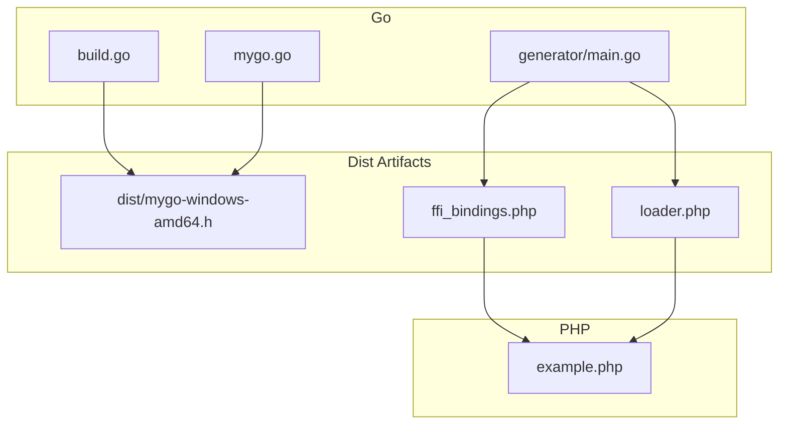
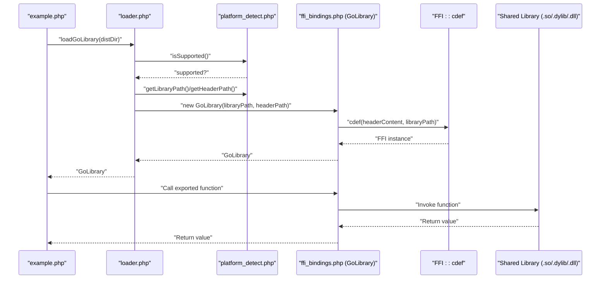
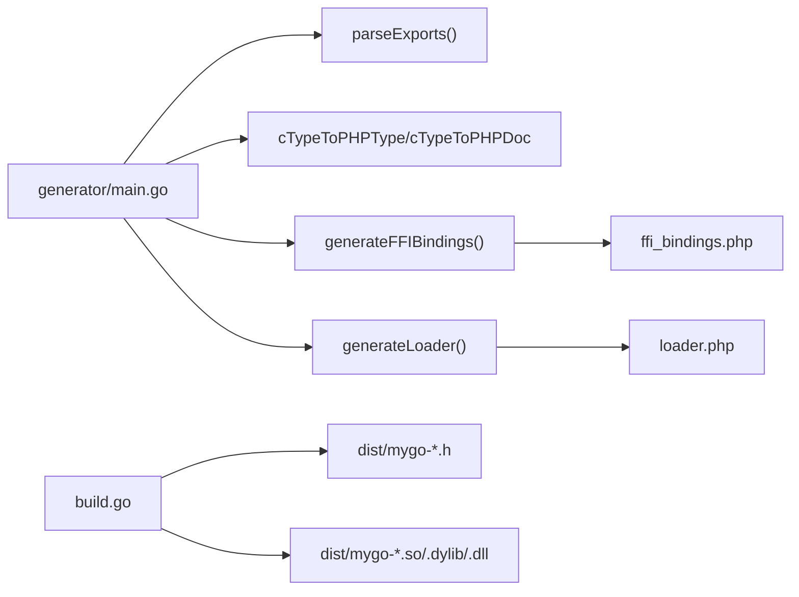

# Function Call Failures

<cite>
**Referenced Files in This Document**
- [generator/main.go](file://generator/main.go)
- [mygo.go](file://mygo.go)
- [example.php](file://example.php)
- [README.md](file://README.md)
- [build.go](file://build.go)
- [ffi_bindings.php](file://ffi_bindings.php)
- [loader.php](file://loader.php)
- [dist/mygo-windows-amd64.h](file://dist/mygo-windows-amd64.h)
</cite>

## Table of Contents
1. [Introduction](#introduction)
2. [Project Structure](#project-structure)
3. [Core Components](#core-components)
4. [Architecture Overview](#architecture-overview)
5. [Detailed Component Analysis](#detailed-component-analysis)
6. [Dependency Analysis](#dependency-analysis)
7. [Performance Considerations](#performance-considerations)
8. [Troubleshooting Guide](#troubleshooting-guide)
9. [Conclusion](#conclusion)

## Introduction
This document explains how function call failures occur in the serviceLib project and how to diagnose and resolve them. It focuses on:
- Unexpected return values, crashes, and memory management issues when calling Go functions from PHP via FFI
- How the GoLibrary class wraps FFI calls and why correct type mapping between Go and PHP is essential
- Proper invocation patterns and error handling using example.php
- String handling pitfalls and the requirement to free memory allocated by Go using FreeString()
- Function signature mismatches between generated bindings and the actual library, and how to regenerate bindings when Go functions change
- Debugging techniques for tracing FFI call issues

## Project Structure
The project consists of:
- A Go library with exported functions
- A code generator that produces PHP FFI bindings
- A build orchestrator for cross-platform shared libraries
- A PHP example demonstrating correct usage and error handling
- Documentation and troubleshooting guidance

**Diagram sources**
- [generator/main.go](file://generator/main.go#L1-L705)
- [mygo.go](file://mygo.go#L1-L39)
- [build.go](file://build.go#L1-L183)
- [dist/mygo-windows-amd64.h](file://dist/mygo-windows-amd64.h#L1-L101)
- [ffi_bindings.php](file://ffi_bindings.php#L1-L89)
- [loader.php](file://loader.php#L1-L58)
- [example.php](file://example.php#L1-L95)

**Section sources**
- [README.md](file://README.md#L1-L384)
- [generator/main.go](file://generator/main.go#L1-L705)
- [build.go](file://build.go#L1-L183)

## Core Components
- GoLibrary (PHP): Wraps FFI calls and loads the shared library using the header definition. It validates environment prerequisites and throws descriptive errors on failure.
- Code Generator (Go): Parses exported functions from Go source, generates PHP FFI bindings and loader code, and maps C/Go types to PHP types.
- Build Orchestrator (Go): Builds cross-platform shared libraries and headers, and copies generated PHP files to dist.
- Example Application (PHP): Demonstrates correct usage patterns, including string handling and memory cleanup.

Key responsibilities:
- Type mapping: Ensures PHP signatures match the C/Go types exposed by the shared library.
- Error propagation: Throws exceptions for unsupported platforms, missing files, and FFI load failures.
- Memory safety: Requires explicit freeing of strings returned by Go.

**Section sources**
- [ffi_bindings.php](file://ffi_bindings.php#L1-L89)
- [generator/main.go](file://generator/main.go#L341-L705)
- [build.go](file://build.go#L1-L183)
- [example.php](file://example.php#L1-L95)

## Architecture Overview
The system integrates Go and PHP across platforms:
- Go exports functions with //export directives and builds a shared library with c-shared mode
- The generator reads exported functions and creates PHP bindings that call FFI::cdef with the generated header
- The loader selects the correct platform-specific library and header, constructs GoLibrary, and exposes a simple API
- The example app exercises the API and demonstrates proper string handling and memory management

**Diagram sources**
- [loader.php](file://loader.php#L1-L58)
- [ffi_bindings.php](file://ffi_bindings.php#L1-L89)
- [dist/mygo-windows-amd64.h](file://dist/mygo-windows-amd64.h#L1-L101)
- [example.php](file://example.php#L1-L95)

## Detailed Component Analysis

### GoLibrary Class and FFI Wrapping
The GoLibrary class encapsulates FFI loading and function calls:
- Validates that the FFI extension is loaded and that library/header files exist
- Reads the header file and initializes FFI via cdef
- Exposes wrapper methods mirroring the exported functions
- Does not perform type conversion itself; relies on the header’s type definitions

Common failure modes:
- FFI extension disabled or missing
- Library or header file not found
- FFI::cdef fails due to incompatible header or wrong library path
- Calling functions with incorrect parameter types or counts

Best practices:
- Always verify platform support before loading
- Ensure the correct library/header pair for the current platform
- Match PHP parameter types to the C/Go types defined in the header

**Section sources**
- [ffi_bindings.php](file://ffi_bindings.php#L1-L89)
- [loader.php](file://loader.php#L1-L58)

### Code Generator and Type Mapping
The generator parses exported functions from Go source and writes PHP wrappers:
- Extracts function names, comments, parameters, and return types
- Generates PHPDoc and type hints by converting C/Go types to PHP equivalents
- Writes a GoLibrary wrapper that forwards calls to FFI

Type mapping highlights:
- Strings: char* and GoString map to PHP string
- Arrays/Slices/Maps: map to PHP array
- Integers/floats/booleans: mapped to PHP int/float/bool
- void returns: no return value in PHP wrapper

Potential mismatches:
- If Go function signatures change, the generated PHP bindings become stale
- If the header changes without regeneration, FFI::cdef may fail

**Section sources**
- [generator/main.go](file://generator/main.go#L341-L705)
- [dist/mygo-windows-amd64.h](file://dist/mygo-windows-amd64.h#L1-L101)

### Example Application: Correct Invocation Patterns and Error Handling
The example demonstrates:
- Loading the library and catching exceptions
- Calling integer-returning functions
- Working with strings returned by Go functions
- Freeing Go-allocated strings using FreeString()

Key patterns:
- Use try-catch around library loading and function calls
- Convert FFI pointers to PHP strings using FFI::string
- Always call FreeString on pointers returned by Go to prevent leaks

**Section sources**
- [example.php](file://example.php#L1-L95)
- [README.md](file://README.md#L195-L209)

### String Handling and Memory Management
Issues commonly arise when:
- Returning strings from Go to PHP without freeing them
- Passing strings incorrectly across boundaries
- Assuming PHP manages memory allocated by Go

Guidelines:
- Always free strings allocated by Go using FreeString
- Use FFI::string to convert C strings to PHP strings
- Avoid reusing freed pointers

**Section sources**
- [example.php](file://example.php#L54-L86)
- [README.md](file://README.md#L195-L209)

### Function Signature Mismatches and Regeneration
Symptoms:
- Runtime errors when calling functions
- Type coercion failures
- ABI incompatibilities

Resolution:
- Update the Go function signatures in mygo.go
- Run the generator to regenerate PHP bindings
- Rebuild the shared library and headers
- Verify the header reflects the new signatures

**Section sources**
- [mygo.go](file://mygo.go#L1-L39)
- [generator/main.go](file://generator/main.go#L1-L187)
- [README.md](file://README.md#L155-L194)

### Cross-Platform Build and Distribution
The build orchestrator compiles for multiple platforms and copies generated PHP files to dist:
- Creates dist directory and outputs platform-specific libraries and headers
- Copies platform_detect.php, ffi_bindings.php, and loader.php into dist
- Reports success/failure per platform

Tip: Use this to distribute prebuilt binaries and PHP bindings.

**Section sources**
- [build.go](file://build.go#L1-L183)

## Dependency Analysis
The generator depends on:
- Go source parsing and header generation
- PHP file generation for platform detection, bindings, and loader
- Build orchestration for cross-platform compilation

**Diagram sources**
- [generator/main.go](file://generator/main.go#L1-L705)
- [build.go](file://build.go#L1-L183)
- [dist/mygo-windows-amd64.h](file://dist/mygo-windows-amd64.h#L1-L101)

**Section sources**
- [generator/main.go](file://generator/main.go#L1-L705)
- [build.go](file://build.go#L1-L183)

## Performance Considerations
- Library loading occurs once per process; reuse the GoLibrary instance
- FFI overhead is minimal compared to native C extensions
- String conversions incur overhead; batch operations when possible
- Always free Go-allocated strings to prevent memory leaks

[No sources needed since this section provides general guidance]

## Troubleshooting Guide

Common failure categories and resolutions:
- FFI extension not enabled
  - Enable the FFI extension and restart the service
  - Reference: [README.md](file://README.md#L240-L251)

- Library or header not found
  - Ensure you ran the generator and built the library
  - Verify the dist directory contains the correct files
  - Reference: [README.md](file://README.md#L252-L266)

- Unsupported platform
  - Build for your platform or add support in build.go
  - Reference: [README.md](file://README.md#L261-L266)

- CGO disabled
  - Enable CGO and ensure a C compiler is available
  - Reference: [README.md](file://README.md#L267-L278)

- DLL loading errors on Windows
  - Check architecture compatibility and runtime dependencies
  - Reference: [README.md](file://README.md#L279-L295)

Debugging techniques:
- Inspect platform detection and paths
  - Use getMygoPlatformInfo() to confirm OS/arch and filenames
  - Reference: [loader.php](file://loader.php#L49-L58), [README.md](file://README.md#L132-L149)

- Validate header and library pairing
  - Confirm the header matches the compiled library
  - Reference: [dist/mygo-windows-amd64.h](file://dist/mygo-windows-amd64.h#L1-L101)

- Trace FFI load failures
  - Catch and log exceptions during library initialization
  - Reference: [ffi_bindings.php](file://ffi_bindings.php#L22-L46)

- Verify function signatures
  - Compare Go function signatures with the generated PHP wrappers
  - Reference: [generator/main.go](file://generator/main.go#L341-L705), [mygo.go](file://mygo.go#L1-L39)

- Ensure correct string handling
  - Convert pointers to PHP strings and free them
  - Reference: [example.php](file://example.php#L54-L86), [README.md](file://README.md#L195-L209)

**Section sources**
- [README.md](file://README.md#L238-L309)
- [loader.php](file://loader.php#L49-L58)
- [ffi_bindings.php](file://ffi_bindings.php#L22-L46)
- [dist/mygo-windows-amd64.h](file://dist/mygo-windows-amd64.h#L1-L101)
- [generator/main.go](file://generator/main.go#L341-L705)
- [mygo.go](file://mygo.go#L1-L39)
- [example.php](file://example.php#L54-L86)

## Conclusion
Function call failures in serviceLib typically stem from:
- Incorrect type mapping between Go and PHP
- Missing or mismatched headers/libraries
- Improper string handling leading to memory leaks or crashes
- Outdated bindings after Go function changes

By following the generator-driven workflow, validating platform compatibility, and adhering to proper string lifecycle management, you can reliably integrate Go functions into PHP via FFI and minimize failures.