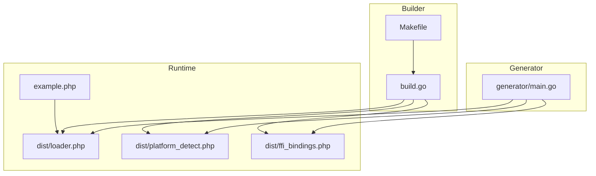
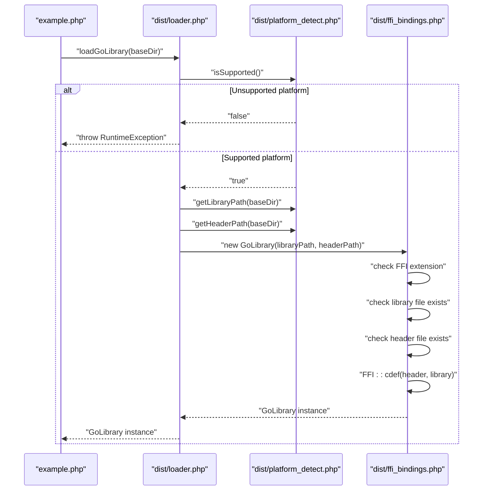
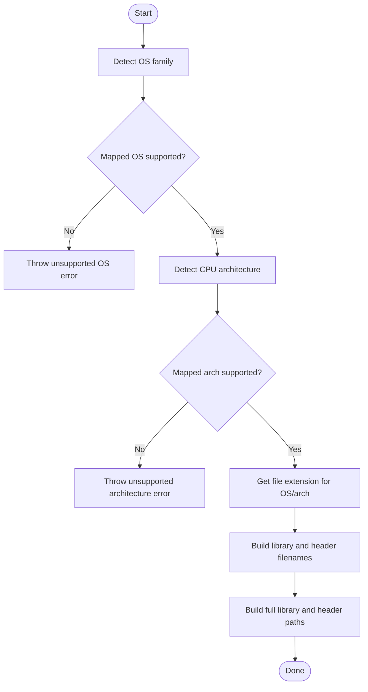
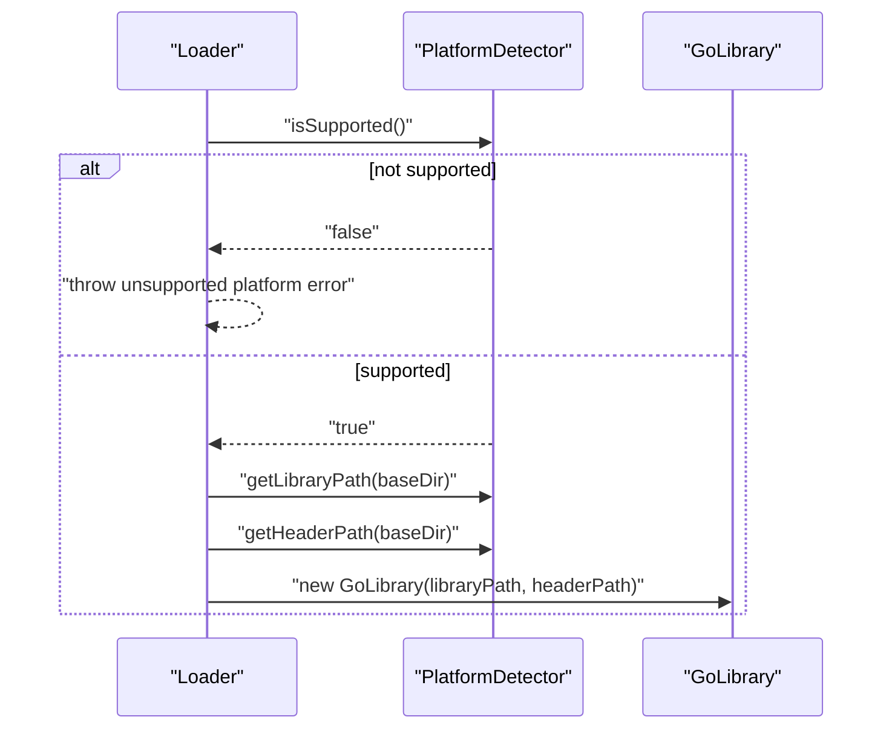
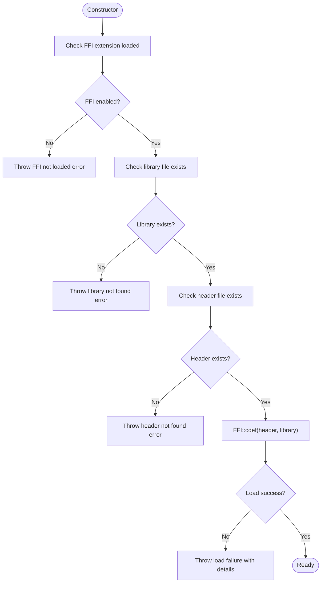
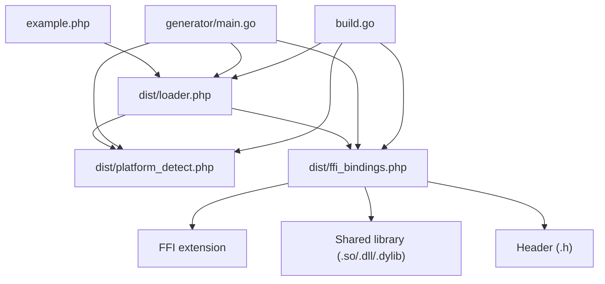

# Library Loading Issues

<cite>
**Referenced Files in This Document**
- [generator/main.go](file://generator/main.go)
- [build.go](file://build.go)
- [example.php](file://example.php)
- [README.md](file://README.md)
- [dist/loader.php](file://dist/loader.php)
- [dist/platform_detect.php](file://dist/platform_detect.php)
- [dist/ffi_bindings.php](file://dist/ffi_bindings.php)
- [mygo.go](file://mygo.go)
- [Makefile](file://Makefile)
</cite>

## Table of Contents
1. [Introduction](#introduction)
2. [Project Structure](#project-structure)
3. [Core Components](#core-components)
4. [Architecture Overview](#architecture-overview)
5. [Detailed Component Analysis](#detailed-component-analysis)
6. [Dependency Analysis](#dependency-analysis)
7. [Performance Considerations](#performance-considerations)
8. [Troubleshooting Guide](#troubleshooting-guide)
9. [Conclusion](#conclusion)

## Introduction
This document explains how the service library handles library loading errors, focusing on “library not found,” incorrect library paths, and missing dynamic dependencies. It also details how the platform detection system determines the correct library filename and path based on OS and architecture, and how the loader integrates with platform detection and FFI bindings. Finally, it provides troubleshooting steps for verifying library existence, checking file permissions, validating the distribution directory structure, and diagnosing issues with the FFI extension.

## Project Structure
The project is organized around a Go-based generator that produces PHP files for platform detection, FFI bindings, and a loader. A separate Go program builds cross-platform shared libraries and copies the generated PHP files into a distribution directory. An example PHP script demonstrates proper error handling when libraries are missing.

**Diagram sources**
- [generator/main.go](file://generator/main.go#L1-L705)
- [build.go](file://build.go#L1-L183)
- [Makefile](file://Makefile#L1-L54)
- [dist/loader.php](file://dist/loader.php#L1-L58)
- [dist/platform_detect.php](file://dist/platform_detect.php#L1-L146)
- [dist/ffi_bindings.php](file://dist/ffi_bindings.php#L1-L89)
- [example.php](file://example.php#L1-L95)

**Section sources**
- [README.md](file://README.md#L1-L210)
- [Makefile](file://Makefile#L1-L54)

## Core Components
- Platform detection module: Determines OS family, CPU architecture, and the correct file extension and filenames for the shared library and header.
- Loader: Orchestrates platform detection, validates platform support, resolves library and header paths, and constructs the FFI wrapper.
- FFI bindings: Validates that the FFI extension is loaded, checks for the presence of the library and header files, and loads the shared library via FFI.
- Build system: Generates cross-platform shared libraries and copies PHP files into the distribution directory.

Key responsibilities:
- Platform detection: OS family and architecture mapping, supported platform validation, and filename/path construction.
- Loader: Central entry point for loading the library; throws explicit errors for unsupported platforms and invalid paths.
- FFI bindings: Enforces prerequisites (FFI enabled), verifies file existence, and reports detailed load failures.

**Section sources**
- [dist/platform_detect.php](file://dist/platform_detect.php#L1-L146)
- [dist/loader.php](file://dist/loader.php#L1-L58)
- [dist/ffi_bindings.php](file://dist/ffi_bindings.php#L1-L89)
- [build.go](file://build.go#L1-L183)

## Architecture Overview
The runtime loading flow is composed of three PHP modules and one Go builder. The generator creates the PHP modules; the builder compiles shared libraries and copies the PHP modules into the distribution directory. At runtime, the example script loads the loader, which delegates to platform detection and FFI bindings.

**Diagram sources**
- [dist/loader.php](file://dist/loader.php#L1-L58)
- [dist/platform_detect.php](file://dist/platform_detect.php#L1-L146)
- [dist/ffi_bindings.php](file://dist/ffi_bindings.php#L1-L89)
- [example.php](file://example.php#L1-L95)

## Detailed Component Analysis

### Platform Detection System
The platform detection module determines the correct library filename and path by:
- Detecting OS family using the runtime environment.
- Detecting CPU architecture and mapping it to standardized names.
- Selecting the appropriate file extension based on OS/arch.
- Constructing the library and header filenames and full paths.

**Diagram sources**
- [dist/platform_detect.php](file://dist/platform_detect.php#L1-L146)

**Section sources**
- [dist/platform_detect.php](file://dist/platform_detect.php#L1-L146)

### Loader and Error Propagation
The loader coordinates platform detection and library instantiation. It:
- Validates platform support.
- Resolves library and header paths.
- Instantiates the FFI bindings class, which performs additional validations.

**Diagram sources**
- [dist/loader.php](file://dist/loader.php#L1-L58)
- [dist/platform_detect.php](file://dist/platform_detect.php#L1-L146)
- [dist/ffi_bindings.php](file://dist/ffi_bindings.php#L1-L89)

**Section sources**
- [dist/loader.php](file://dist/loader.php#L1-L58)

### FFI Bindings and Dynamic Dependencies
The FFI bindings class enforces prerequisites and validates the library and header files:
- Ensures the FFI extension is loaded.
- Verifies the library file exists.
- Verifies the header file exists.
- Attempts to load the library via FFI and surfaces detailed errors.

Dynamic dependency issues commonly arise when:
- The shared library depends on system libraries not present on the target platform.
- The library is compiled for a different architecture than the PHP runtime.
- The library path is incorrect or inaccessible.

**Diagram sources**
- [dist/ffi_bindings.php](file://dist/ffi_bindings.php#L1-L89)

**Section sources**
- [dist/ffi_bindings.php](file://dist/ffi_bindings.php#L1-L89)

### Example Usage and Error Handling
The example script demonstrates:
- Loading the loader.
- Retrieving platform information.
- Attempting to load the library and handling exceptions.

It serves as a reference for proper error handling when libraries are missing or misconfigured.

**Section sources**
- [example.php](file://example.php#L1-L95)

## Dependency Analysis
The runtime depends on:
- Platform detection for filename/path resolution.
- Loader for orchestration and error propagation.
- FFI bindings for validation and FFI loading.
- Build system for generating cross-platform binaries and copying PHP files.

**Diagram sources**
- [example.php](file://example.php#L1-L95)
- [dist/loader.php](file://dist/loader.php#L1-L58)
- [dist/platform_detect.php](file://dist/platform_detect.php#L1-L146)
- [dist/ffi_bindings.php](file://dist/ffi_bindings.php#L1-L89)
- [generator/main.go](file://generator/main.go#L1-L705)
- [build.go](file://build.go#L1-L183)

**Section sources**
- [generator/main.go](file://generator/main.go#L1-L705)
- [build.go](file://build.go#L1-L183)

## Performance Considerations
- Library loading occurs once per PHP process; using persistent processes (for example, PHP-FPM) improves performance.
- FFI overhead is minimal compared to native C extensions.
- String conversions between PHP and C incur overhead; batch operations when possible.
- Always free Go-allocated strings to prevent memory leaks.

[No sources needed since this section provides general guidance]

## Troubleshooting Guide

### 1) Library Not Found
Symptoms:
- Error indicating the library file was not found.
- Error indicating the header file was not found.

Common causes:
- Missing or empty distribution directory.
- Incorrect base directory passed to the loader.
- Library not built for the current platform.
- Missing or corrupted shared library or header file.

Verification steps:
- Confirm the distribution directory exists and contains the expected files:
  - Library file named according to the platform-specific pattern.
  - Header file with the corresponding platform name.
- Verify the base directory path passed to the loader matches the location of the distribution directory.
- Ensure the build process copied the generated PHP files into the distribution directory.

Recovery:
- Re-run the build process to regenerate and copy the files.
- Confirm the correct platform’s shared library and header are present.

**Section sources**
- [dist/ffi_bindings.php](file://dist/ffi_bindings.php#L1-L89)
- [dist/loader.php](file://dist/loader.php#L1-L58)
- [build.go](file://build.go#L1-L183)

### 2) Incorrect Library Paths
Symptoms:
- Unsupported platform error.
- Path resolution issues leading to missing files.

Causes:
- Passing an incorrect base directory to the loader.
- Platform detection mismatches due to environment differences.

Resolution:
- Pass the correct distribution directory path to the loader.
- Ensure the environment variables and runtime settings match the intended platform.

**Section sources**
- [dist/loader.php](file://dist/loader.php#L1-L58)
- [dist/platform_detect.php](file://dist/platform_detect.php#L1-L146)

### 3) Missing Dynamic Dependencies
Symptoms:
- Load failures when attempting to initialize FFI.
- Platform-specific DLL loading errors on Windows.

Causes:
- Missing system libraries required by the shared library.
- Architecture mismatch between the library and the PHP runtime.
- Antivirus or security software blocking library loading.

Resolution:
- On Windows, verify the correct architecture (32-bit vs 64-bit) for both PHP and the DLL.
- Install required runtime libraries (for example, Microsoft Visual C++ Redistributable).
- Temporarily disable antivirus exclusions to test loading.
- Validate that the library loads without external dependencies on a clean environment.

**Section sources**
- [README.md](file://README.md#L238-L310)
- [dist/ffi_bindings.php](file://dist/ffi_bindings.php#L1-L89)

### 4) FFI Extension Not Loaded
Symptoms:
- Explicit error stating the FFI extension is not loaded.

Causes:
- FFI disabled in the PHP configuration.
- Missing or misconfigured PHP installation.

Resolution:
- Enable the FFI extension in the PHP configuration and restart the web server or PHP-FPM.
- Verify the extension is loaded in the current runtime.

**Section sources**
- [dist/ffi_bindings.php](file://dist/ffi_bindings.php#L1-L89)
- [README.md](file://README.md#L240-L251)

### 5) Verifying Distribution Directory Structure
Ensure the distribution directory contains:
- Platform-specific shared library files.
- Matching header files.
- The generated PHP loader, platform detection, and FFI binding files.

Validation:
- Compare the filenames against the supported platform matrix.
- Confirm the loader and platform detection files are present and readable.

**Section sources**
- [README.md](file://README.md#L25-L41)
- [build.go](file://build.go#L1-L183)

### 6) Example Script Behavior
The example script demonstrates:
- How to load the loader.
- How to retrieve platform information.
- How to handle exceptions during library loading.

Use it as a reference for robust error handling in production environments.

**Section sources**
- [example.php](file://example.php#L1-L95)

## Conclusion
The service library’s loading system separates concerns across platform detection, loader orchestration, and FFI bindings. Clear error messages guide users to resolve “library not found,” incorrect paths, and missing dynamic dependencies. By following the troubleshooting steps—verifying the distribution directory, confirming platform support, enabling the FFI extension, and validating architecture compatibility—you can reliably diagnose and fix library loading issues across platforms.