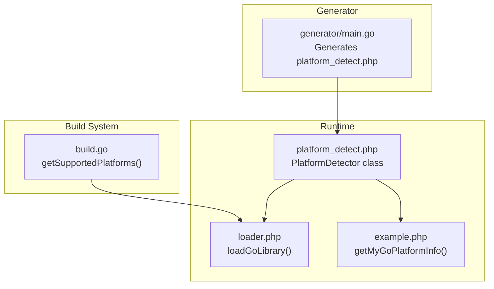
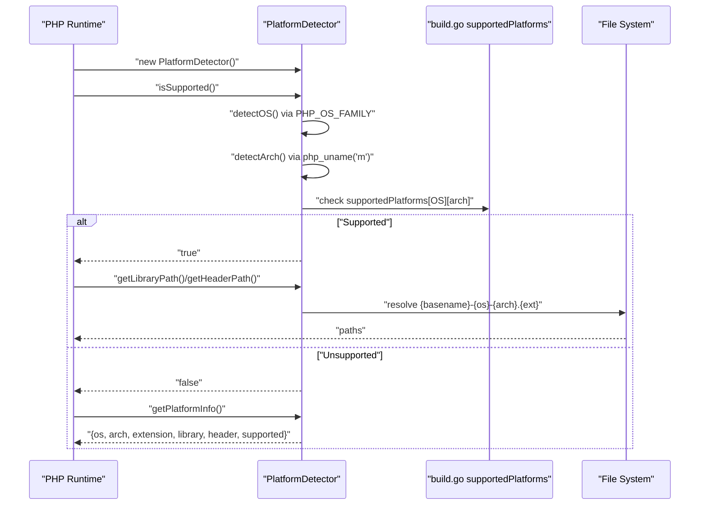
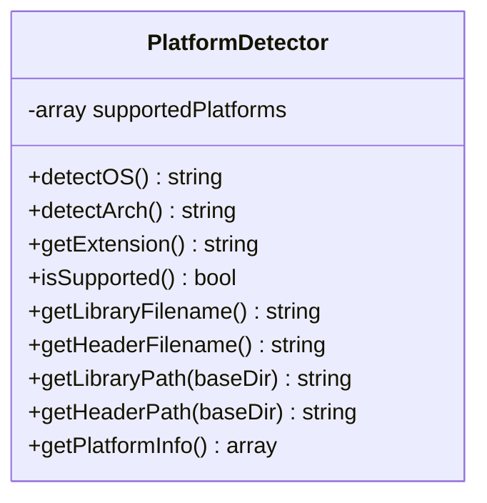
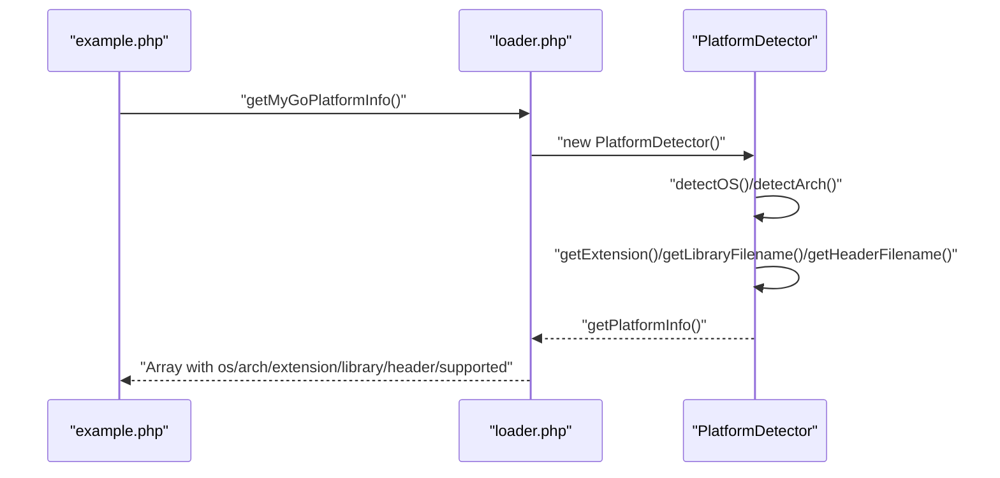
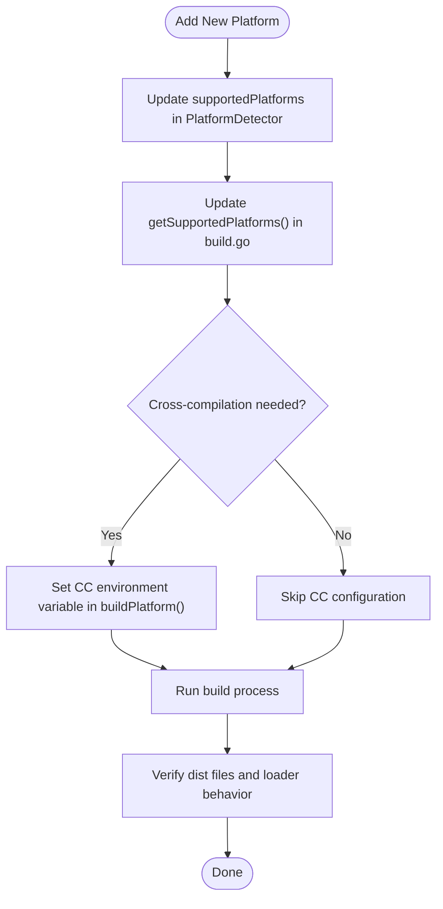
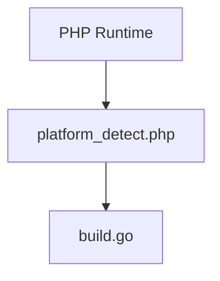

# Platform Detection Problems

<cite>
**Referenced Files in This Document**
- [generator/main.go](file://generator/main.go)
- [build.go](file://build.go)
- [example.php](file://example.php)
- [README.md](file://README.md)
- [AGENTS.MD](file://AGENTS.MD)
</cite>

## Table of Contents
1. [Introduction](#introduction)
2. [Project Structure](#project-structure)
3. [Core Components](#core-components)
4. [Architecture Overview](#architecture-overview)
5. [Detailed Component Analysis](#detailed-component-analysis)
6. [Dependency Analysis](#dependency-analysis)
7. [Performance Considerations](#performance-considerations)
8. [Troubleshooting Guide](#troubleshooting-guide)
9. [Conclusion](#conclusion)
10. [Appendices](#appendices)

## Introduction
This document focuses on platform detection failures in serviceLib and explains how the PlatformDetector class uses PHP_OS_FAMILY and php_uname() to identify the operating system and architecture. It also documents the supported platform matrix (Linux, Darwin, Windows with amd64/arm64) and their corresponding file extensions (.so, .dylib, .dll). The example.php file demonstrates how getMyGoPlatformInfo() displays platform information for debugging. Guidance is included for troubleshooting unsupported combinations, handling architecture naming variations (x86_64 vs AMD64), extending the supportedPlatforms array for new platforms, and addressing issues with PHP returning unexpected values from system functions.

## Project Structure
The platform detection logic is generated into platform_detect.php by the Go-based code generator. The loader.php file consumes the detector to load the correct shared library for the current platform. The build.go script defines the supported platforms and their extensions, while example.php shows how to display and use platform information.

**Diagram sources**
- [generator/main.go](file://generator/main.go#L190-L339)
- [build.go](file://build.go#L19-L29)
- [loader.php](file://generator/main.go#L642-L704)
- [example.php](file://example.php#L1-L20)

**Section sources**
- [generator/main.go](file://generator/main.go#L190-L339)
- [build.go](file://build.go#L19-L29)
- [example.php](file://example.php#L1-L20)

## Core Components
- PlatformDetector class in platform_detect.php:
  - Uses PHP_OS_FAMILY to detect OS family.
  - Uses php_uname('m') to detect machine architecture.
  - Maintains a supportedPlatforms map keyed by OS and architecture to file extensions.
  - Provides methods to get OS, arch, extension, filenames, and platform info.
- loader.php:
  - Uses PlatformDetector to validate platform support and construct library/header paths.
  - Exposes getMyGoPlatformInfo() for debugging platform details.
- build.go:
  - Defines supported platforms and their extensions for cross-compilation.
  - Ensures consistent naming and file extensions across platforms.

**Section sources**
- [generator/main.go](file://generator/main.go#L190-L339)
- [generator/main.go](file://generator/main.go#L642-L704)
- [build.go](file://build.go#L19-L29)

## Architecture Overview
The platform detection pipeline integrates runtime detection with build-time platform definitions. The generator creates platform_detect.php with a PlatformDetector class that inspects PHP_OS_FAMILY and php_uname('m'), maps them to standardized names, checks against supportedPlatforms, and derives filenames and extensions. The loader.php validates support and loads the correct library and header files.

**Diagram sources**
- [generator/main.go](file://generator/main.go#L190-L339)
- [build.go](file://build.go#L19-L29)
- [generator/main.go](file://generator/main.go#L642-L704)

## Detailed Component Analysis

### PlatformDetector Class
The PlatformDetector class encapsulates platform detection and filename resolution. It uses:
- PHP_OS_FAMILY to normalize OS family to lowercase identifiers.
- php_uname('m') to extract machine architecture and normalize to amd64/arm64.
- A supportedPlatforms map to validate combinations and resolve file extensions.

Key behaviors:
- detectOS(): Maps PHP_OS_FAMILY to 'linux', 'darwin', or 'windows'.
- detectArch(): Normalizes common architecture names to 'amd64' or 'arm64'.
- getExtension(): Validates OS/arch against supportedPlatforms and returns the appropriate extension.
- isSupported(): Returns true only if both OS and arch are supported.
- getLibraryFilename()/getHeaderFilename(): Builds filenames using the base name and detected OS/arch.
- getPlatformInfo(): Returns a structured array for debugging.

**Diagram sources**
- [generator/main.go](file://generator/main.go#L190-L339)

**Section sources**
- [generator/main.go](file://generator/main.go#L190-L339)

### Supported Platform Matrix and Extensions
The supported platform matrix and file extensions are defined in two places:
- PlatformDetector’s supportedPlatforms map (used at runtime).
- build.go getSupportedPlatforms() (used at build time).

Matrix:
- Linux: amd64 -> .so, arm64 -> .so
- Darwin: amd64 -> .dylib, arm64 -> .dylib
- Windows: amd64 -> .dll, arm64 -> .dll

These definitions ensure consistent naming and extension resolution across generation, loading, and distribution.

**Section sources**
- [generator/main.go](file://generator/main.go#L202-L206)
- [build.go](file://build.go#L21-L27)

### Example: getMyGoPlatformInfo() Debugging
The example.php script demonstrates how to retrieve and display platform information using getMyGoPlatformInfo(). This function internally constructs a PlatformDetector instance and returns getPlatformInfo(), enabling quick diagnosis of OS, architecture, extension, and filename resolution.

**Diagram sources**
- [generator/main.go](file://generator/main.go#L692-L701)
- [generator/main.go](file://generator/main.go#L321-L335)
- [example.php](file://example.php#L12-L19)

**Section sources**
- [example.php](file://example.php#L12-L19)
- [generator/main.go](file://generator/main.go#L692-L701)
- [generator/main.go](file://generator/main.go#L321-L335)

### Troubleshooting Unsupported Combinations
Common failure scenarios and resolutions:
- Unsupported OS family:
  - Cause: PHP_OS_FAMILY returns an unexpected value.
  - Resolution: Extend the detectOS() switch to handle additional families or normalize values before detection.
- Unsupported architecture:
  - Cause: php_uname('m') returns an unrecognized value (e.g., 'x86_64' vs 'AMD64').
  - Resolution: Normalize architecture names in detectArch() to 'amd64' or 'arm64'.
- Unsupported OS/arch combination:
  - Cause: supportedPlatforms lacks the detected pair.
  - Resolution: Add entries to supportedPlatforms and update build.go getSupportedPlatforms() for cross-compilation.
- Library not found:
  - Cause: Path constructed from getLibraryPath() does not match actual file.
  - Resolution: Verify dist directory contents and confirm baseDir path passed to loadGoLibrary().

**Section sources**
- [generator/main.go](file://generator/main.go#L212-L247)
- [generator/main.go](file://generator/main.go#L253-L262)
- [build.go](file://build.go#L19-L29)

### Handling Architecture Naming Variations
Architecture normalization is performed in detectArch():
- Recognized AMD64-like names are mapped to 'amd64'.
- Recognized ARM64-like names are mapped to 'arm64'.
If your environment reports a variant not covered, add it to the detectArch() switch to ensure consistent mapping.

**Section sources**
- [generator/main.go](file://generator/main.go#L231-L247)

### Extending supportedPlatforms for New Platforms
To add a new platform:
- Update PlatformDetector’s supportedPlatforms map to include the OS/arch and extension.
- Update build.go getSupportedPlatforms() to include the new Platform entry with correct GOOS, GOARCH, and Extension.
- If cross-compiling, configure the appropriate CC environment variable in buildPlatform() for the target platform.
- Re-run the build process to generate the new shared library and header files.

**Diagram sources**
- [generator/main.go](file://generator/main.go#L202-L206)
- [build.go](file://build.go#L19-L29)
- [build.go](file://build.go#L108-L139)

**Section sources**
- [generator/main.go](file://generator/main.go#L202-L206)
- [build.go](file://build.go#L19-L29)
- [build.go](file://build.go#L108-L139)

### Addressing Unexpected Values from System Functions
Issues with PHP returning unexpected values:
- PHP_OS_FAMILY may differ from expectations on some systems or distributions.
  - Mitigation: Log and inspect PHP_OS_FAMILY before mapping; add fallbacks or additional cases in detectOS().
- php_uname('m') may vary by platform or containerization.
  - Mitigation: Normalize all known aliases in detectArch(); add logging to capture actual values for diagnostics.
- Environment differences (e.g., Docker, CI) can alter reported values.
  - Mitigation: Provide environment-specific overrides or configuration hooks to force OS/arch detection when necessary.

**Section sources**
- [generator/main.go](file://generator/main.go#L212-L247)

## Dependency Analysis
The platform detection relies on:
- PHP runtime constants/functions: PHP_OS_FAMILY, php_uname('m').
- Generator output: platform_detect.php containing PlatformDetector.
- Build-time platform definitions: build.go getSupportedPlatforms().

**Diagram sources**
- [generator/main.go](file://generator/main.go#L190-L339)
- [build.go](file://build.go#L19-L29)

**Section sources**
- [generator/main.go](file://generator/main.go#L190-L339)
- [build.go](file://build.go#L19-L29)

## Performance Considerations
- Platform detection occurs once per process when constructing PlatformDetector. Subsequent calls are inexpensive.
- Avoid repeated filesystem checks; cache paths returned by getLibraryPath()/getHeaderPath() if used frequently.
- Keep supportedPlatforms minimal and precise to reduce branching overhead.

[No sources needed since this section provides general guidance]

## Troubleshooting Guide
Common issues and remedies:
- Unsupported platform error:
  - Confirm OS/arch detection by printing getMyGoPlatformInfo() output.
  - Add the OS/arch to supportedPlatforms and rebuild libraries.
- Library not found:
  - Ensure the dist directory contains the correct file named by getLibraryFilename().
  - Verify the baseDir passed to loadGoLibrary() is correct.
- Architecture mismatch on Windows:
  - Ensure PHP bitness matches the compiled DLL (64-bit PHP with 64-bit DLL).
- FFI disabled:
  - Enable the FFI extension in php.ini and restart the service.

**Section sources**
- [README.md](file://README.md#L238-L309)
- [generator/main.go](file://generator/main.go#L642-L704)

## Conclusion
Platform detection in serviceLib centers on reliable mapping of PHP_OS_FAMILY and php_uname('m') to standardized OS/arch identifiers, validated against a supportedPlatforms map. The loader.php function uses this information to locate and load the correct shared library and header files. When failures occur, inspect getMyGoPlatformInfo() output, normalize architecture names, extend supportedPlatforms, and ensure build-time platform definitions align with runtime expectations.

[No sources needed since this section summarizes without analyzing specific files]

## Appendices

### Appendix A: Supported Platforms Reference
- Linux: amd64 -> .so, arm64 -> .so
- Darwin: amd64 -> .dylib, arm64 -> .dylib
- Windows: amd64 -> .dll, arm64 -> .dll

**Section sources**
- [generator/main.go](file://generator/main.go#L202-L206)
- [build.go](file://build.go#L21-L27)

### Appendix B: Example Debug Output
Use example.php to print platform information returned by getMyGoPlatformInfo(), including os, arch, extension, library, header, and supported flags.

**Section sources**
- [example.php](file://example.php#L12-L19)
- [generator/main.go](file://generator/main.go#L692-L701)