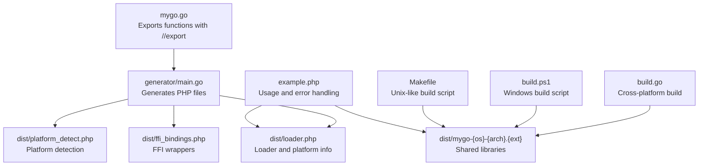
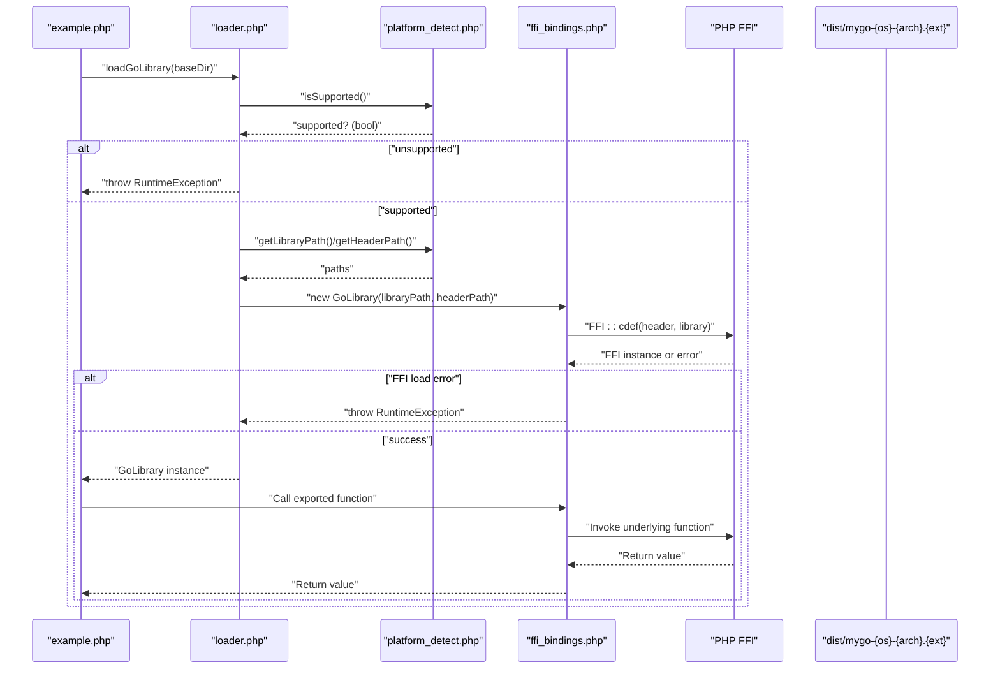
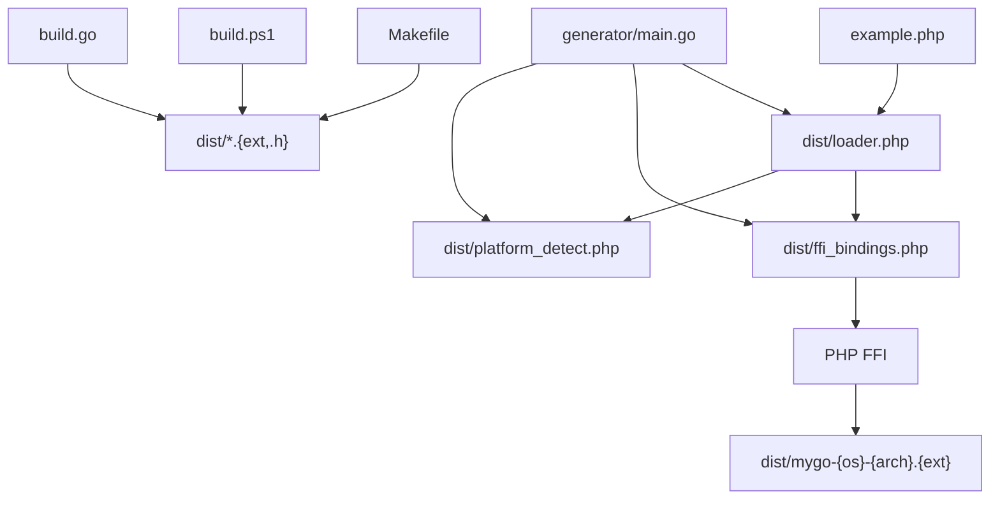

# Runtime Errors

<cite>
**Referenced Files in This Document**
- [README.md](file://README.md)
- [QUICKSTART.md](file://QUICKSTART.md)
- [example.php](file://example.php)
- [generator/main.go](file://generator/main.go)
- [build.go](file://build.go)
- [build.ps1](file://build.ps1)
- [Makefile](file://Makefile)
- [mygo.go](file://mygo.go)
</cite>

## Table of Contents
1. [Introduction](#introduction)
2. [Project Structure](#project-structure)
3. [Core Components](#core-components)
4. [Architecture Overview](#architecture-overview)
5. [Detailed Component Analysis](#detailed-component-analysis)
6. [Dependency Analysis](#dependency-analysis)
7. [Performance Considerations](#performance-considerations)
8. [Troubleshooting Guide](#troubleshooting-guide)
9. [Conclusion](#conclusion)

## Introduction
This document explains runtime errors that commonly occur when loading shared libraries and executing functions in serviceLib. It focuses on:
- Library not found errors
- Platform detection failures
- Incorrect library loading paths
- Dynamic library dependencies and missing runtime components
- Debugging function calls that return unexpected values or cause crashes
- Verifying generated bindings and ensuring version compatibility between generated code and shared libraries

The guidance is grounded in the repository’s build system, generator, loader, and example usage.

## Project Structure
serviceLib provides a complete pipeline:
- Go source exports functions with //export directives
- A generator parses exported functions and produces PHP FFI bindings, platform detection helpers, and a loader
- A build orchestrator compiles shared libraries per platform and copies PHP assets into a distribution directory
- An example PHP application demonstrates correct usage and error handling patterns

**Diagram sources**
- [mygo.go](file://mygo.go#L1-L39)
- [generator/main.go](file://generator/main.go#L1-L705)
- [build.go](file://build.go#L1-L183)
- [build.ps1](file://build.ps1#L1-L152)
- [Makefile](file://Makefile#L1-L54)
- [example.php](file://example.php#L1-L95)

**Section sources**
- [README.md](file://README.md#L1-L120)
- [QUICKSTART.md](file://QUICKSTART.md#L1-L80)

## Core Components
- Platform detection and loader
  - The generator creates a PlatformDetector that inspects PHP_OS_FAMILY and machine architecture to compute the expected library filename and extension. It throws runtime exceptions for unsupported OS/arch combinations.
  - The loader validates platform support, resolves library/header paths, and constructs the FFI wrapper. It throws runtime exceptions if the FFI extension is missing, files are missing, or FFI fails to load the library.
- FFI bindings
  - The generator writes a GoLibrary class that loads the shared library via FFI::cdef and exposes typed wrapper methods mirroring exported functions. It throws runtime exceptions on missing files or FFI load failures.
- Build orchestration
  - The build orchestrator compiles shared libraries per platform and verifies outputs. It also copies PHP files into dist/. Failures here indicate missing toolchains or misconfiguration.

Key runtime error triggers:
- Unsupported platform detected
- Missing library or header file
- FFI extension disabled or unavailable
- FFI load failure due to incompatible ABI or missing dependencies
- Incorrect base directory passed to the loader

**Section sources**
- [generator/main.go](file://generator/main.go#L190-L339)
- [generator/main.go](file://generator/main.go#L341-L418)
- [generator/main.go](file://generator/main.go#L642-L705)
- [build.go](file://build.go#L107-L164)

## Architecture Overview
The runtime error handling spans three layers:
- Platform detection and path resolution
- FFI initialization and function dispatch
- Build-time verification and packaging

**Diagram sources**
- [example.php](file://example.php#L1-L95)
- [generator/main.go](file://generator/main.go#L642-L705)
- [generator/main.go](file://generator/main.go#L341-L418)

## Detailed Component Analysis

### Platform Detection and Loader
- PlatformDetector
  - Detects OS family and architecture, maps them to supported combinations, and computes library/header filenames. Throws runtime exceptions for unsupported OS, architecture, or platform combinations.
- Loader
  - Validates platform support, resolves absolute paths, and instantiates the FFI wrapper. Throws runtime exceptions when platform is unsupported.

Common runtime errors:
- Unsupported platform: thrown when OS or architecture is not supported
- Path resolution errors: thrown when baseDir is incorrect or files are missing

**Section sources**
- [generator/main.go](file://generator/main.go#L190-L339)
- [generator/main.go](file://generator/main.go#L642-L705)

### FFI Bindings and Library Loading
- GoLibrary constructor
  - Requires FFI extension to be loaded
  - Verifies existence of library and header files
  - Attempts FFI::cdef to load the shared library
  - Throws runtime exceptions on missing files or FFI load failures

Common runtime errors:
- FFI extension not loaded
- Library or header file not found
- FFI load failure (ABI mismatch, wrong architecture, missing runtime components)

**Section sources**
- [generator/main.go](file://generator/main.go#L341-L418)

### Build Orchestration and Distribution
- build.go
  - Builds shared libraries for all supported platforms, sets cross-compilation environment, and verifies outputs and headers are created and non-empty
  - Copies PHP files into dist/
- build.ps1 and Makefile
  - Provide convenience commands to generate bindings, build current platform, build all platforms, and run the example

Common runtime errors:
- Cross-compilation failures due to missing toolchains
- Empty or missing output files
- Missing PHP files in dist/

**Section sources**
- [build.go](file://build.go#L1-L183)
- [build.ps1](file://build.ps1#L1-L152)
- [Makefile](file://Makefile#L1-L54)

### Example Usage and Error Handling Patterns
- example.php
  - Loads the loader, prints platform info, attempts to load the library, and exercises exported functions
  - Wraps execution in a try/catch to capture runtime exceptions and print stack traces
  - Demonstrates correct memory management for strings returned by Go functions

Recommended patterns:
- Wrap library loading in try/catch
- Log platform info before loading
- Validate FFI availability early
- Free Go-allocated strings promptly

**Section sources**
- [example.php](file://example.php#L1-L95)

## Dependency Analysis
The runtime error surface depends on:
- Correctly generated PHP files (platform_detect.php, ffi_bindings.php, loader.php)
- Valid dist layout with library and header files
- Proper environment (FFI enabled, correct architecture, installed runtime components)
- Consistent naming conventions across build and loader

**Diagram sources**
- [generator/main.go](file://generator/main.go#L1-L705)
- [build.go](file://build.go#L1-L183)
- [build.ps1](file://build.ps1#L1-L152)
- [Makefile](file://Makefile#L1-L54)
- [example.php](file://example.php#L1-L95)

**Section sources**
- [generator/main.go](file://generator/main.go#L1-L705)
- [build.go](file://build.go#L1-L183)
- [example.php](file://example.php#L1-L95)

## Performance Considerations
- Library loading occurs once per process; reuse the GoLibrary instance to avoid repeated FFI initialization overhead.
- Prefer persistent processes (e.g., PHP-FPM) to minimize repeated loads.
- Avoid excessive conversions between PHP and C strings; batch operations when feasible.
- Ensure the library is built for the correct architecture to prevent runtime rejections.

[No sources needed since this section provides general guidance]

## Troubleshooting Guide

### Library Not Found
Symptoms:
- RuntimeException indicating the library or header file was not found
- Loader throws when platform is unsupported

Resolution steps:
- Confirm that PHP files were generated and copied into dist/
- Verify the base directory passed to loadGoLibrary is correct
- Ensure the dist directory contains the platform-specific shared library and header file
- Re-run the build process to regenerate and repack assets

**Section sources**
- [generator/main.go](file://generator/main.go#L341-L418)
- [generator/main.go](file://generator/main.go#L642-L705)

### Platform Detection Failures
Symptoms:
- RuntimeException indicating unsupported OS, architecture, or platform combination

Resolution steps:
- Check PHP_OS_FAMILY and machine architecture mapping
- Ensure the platform is included in supported combinations
- Rebuild for the current platform if necessary

**Section sources**
- [generator/main.go](file://generator/main.go#L190-L339)

### Incorrect Library Loading Paths
Symptoms:
- FFI load failures or runtime crashes when calling functions
- Wrong baseDir passed to loader

Resolution steps:
- Use the loader’s default baseDir or pass an absolute path
- Confirm that the library and header paths resolve to the same directory
- Validate that the library filename matches the expected pattern

**Section sources**
- [generator/main.go](file://generator/main.go#L642-L705)

### Dynamic Library Dependencies and Missing Runtime Components
Symptoms:
- DLL loading errors on Windows
- “Not a valid Win32 application” errors
- Missing runtime components (e.g., Visual C++ Redistributable)

Resolution steps:
- Match PHP architecture (32-bit vs 64-bit) with the compiled library
- Install required runtime components
- Temporarily disable antivirus to rule out interference
- Verify the library’s dependencies with platform tools

**Section sources**
- [README.md](file://README.md#L239-L310)

### Debugging Unexpected Values or Crashes
Symptoms:
- Functions return unexpected values
- Crashes or segmentation faults when calling functions

Resolution steps:
- Validate input types and sizes
- Ensure correct memory management for strings returned by Go functions
- Inspect the generated FFI signatures and confirm they match exported functions
- Compare the generated header against the actual library ABI

**Section sources**
- [example.php](file://example.php#L1-L95)
- [generator/main.go](file://generator/main.go#L341-L418)

### Verifying Generated Bindings and Version Compatibility
Steps:
- Confirm that the header file in dist corresponds to the compiled library
- Ensure the loader and bindings were regenerated after changes to exported functions
- Validate that the library filename follows the standardized naming convention
- Rebuild and repack assets to ensure consistency

**Section sources**
- [README.md](file://README.md#L1-L120)
- [generator/main.go](file://generator/main.go#L1-L705)
- [build.go](file://build.go#L1-L183)

### Example Pattern: Proper Runtime Error Handling
- Wrap library loading in try/catch
- Print platform information before loading
- Log stack traces on exceptions
- Free Go-allocated strings promptly

**Section sources**
- [example.php](file://example.php#L1-L95)

## Conclusion
serviceLib centralizes runtime error handling in the loader and FFI bindings. By validating platform support, checking file presence, and leveraging robust error messages, most runtime issues can be diagnosed quickly. Ensuring correct build outputs, consistent naming, and proper environment configuration minimizes failures. The example application demonstrates recommended patterns for catching and reporting errors during library loading and function execution.