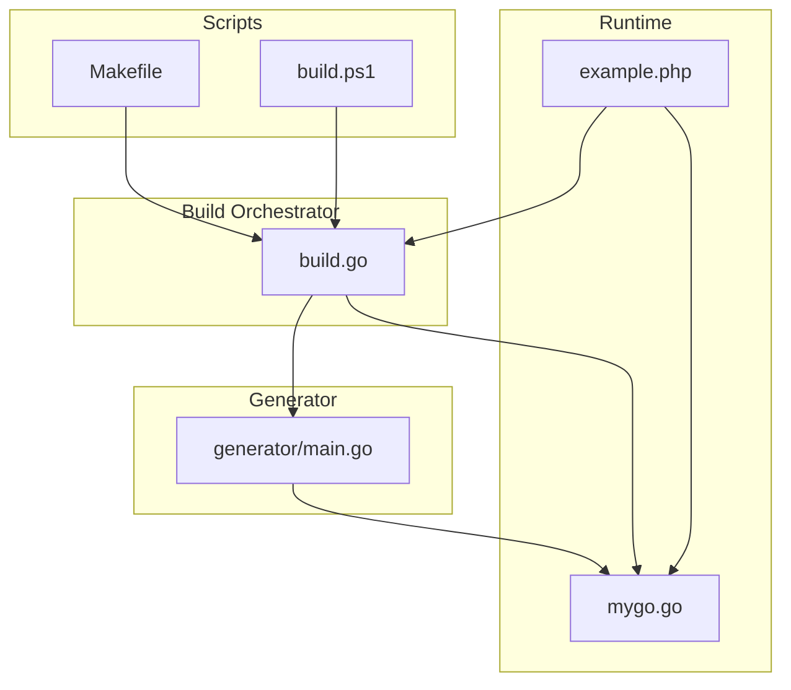
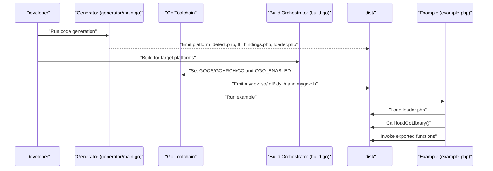
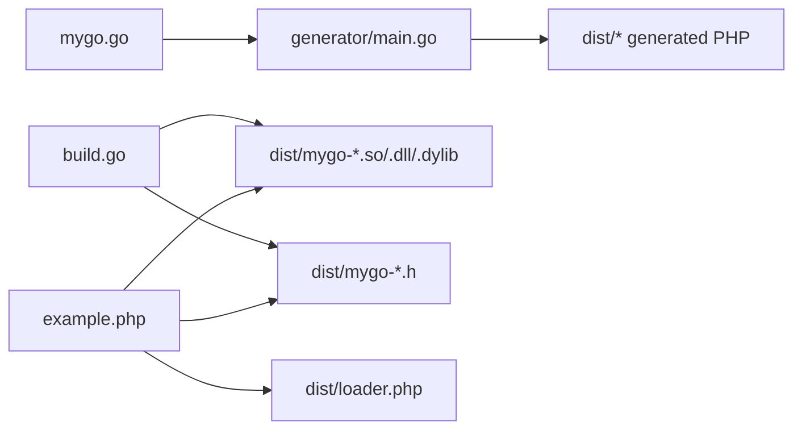

# Troubleshooting

<cite>
**Referenced Files in This Document**
- [README.md](file://README.md)
- [AGENTS.MD](file://AGENTS.MD)
- [QUICKSTART.md](file://QUICKSTART.md)
- [build.go](file://build.go)
- [generator/main.go](file://generator/main.go)
- [mygo.go](file://mygo.go)
- [example.php](file://example.php)
- [Makefile](file://Makefile)
- [build.ps1](file://build.ps1)
- [go.mod](file://go.mod)
</cite>

## Table of Contents
1. [Introduction](#introduction)
2. [Project Structure](#project-structure)
3. [Core Components](#core-components)
4. [Architecture Overview](#architecture-overview)
5. [Detailed Component Analysis](#detailed-component-analysis)
6. [Dependency Analysis](#dependency-analysis)
7. [Performance Considerations](#performance-considerations)
8. [Troubleshooting Guide](#troubleshooting-guide)
9. [Conclusion](#conclusion)

## Introduction
This troubleshooting guide focuses on diagnosing and resolving common issues when using serviceLib to build Go shared libraries for PHP FFI integration. It covers build failures related to missing C compilers or cross-compilation toolchains, PHP FFI issues such as extension not loaded, memory limits, or type conversion errors, debugging strategies for “library not found” errors and platform detection problems, and common CGO compilation errors. It also provides diagnostic steps for verifying each stage of the pipeline: code generation, compilation, and PHP integration, with examples drawn from AGENTS.MD and README.md.

## Project Structure
serviceLib is organized around a small set of files that orchestrate code generation, cross-platform builds, and PHP integration:
- Generator: parses Go source and produces PHP FFI bindings and loaders
- Build orchestrator: compiles shared libraries for multiple platforms
- Example PHP app: exercises the integration and validates behavior
- Build scripts: convenience wrappers for Unix and Windows

**Diagram sources**
- [generator/main.go](file://generator/main.go#L1-L120)
- [build.go](file://build.go#L1-L120)
- [mygo.go](file://mygo.go#L1-L39)
- [example.php](file://example.php#L1-L40)
- [Makefile](file://Makefile#L1-L54)
- [build.ps1](file://build.ps1#L1-L90)

**Section sources**
- [README.md](file://README.md#L25-L41)
- [AGENTS.MD](file://AGENTS.MD#L15-L36)

## Core Components
- Code generator: scans Go source for exported functions and generates PHP FFI bindings, platform detection helpers, and loader functions. It enforces consistent namespaces and method styles.
- Build orchestrator: iterates supported platforms, sets environment variables for cross-compilation, executes builds, verifies outputs, and copies generated PHP files into the distribution directory.
- Example PHP app: loads the library via the generated loader, exercises exported functions, and demonstrates correct memory management for strings returned from Go.

Key diagnostics points:
- Ensure generator runs before compilation and that generated PHP files exist in dist.
- Confirm build orchestrator completes for the target platform and that both the shared library and header are present and non-empty.
- Validate PHP integration by running the example and checking for FFI-related exceptions.

**Section sources**
- [generator/main.go](file://generator/main.go#L1-L120)
- [build.go](file://build.go#L1-L120)
- [example.php](file://example.php#L1-L40)

## Architecture Overview
The end-to-end pipeline integrates Go code generation, cross-platform compilation, and PHP FFI consumption.

**Diagram sources**
- [generator/main.go](file://generator/main.go#L1-L120)
- [build.go](file://build.go#L107-L164)
- [example.php](file://example.php#L1-L40)

## Detailed Component Analysis

### Code Generator (generator/main.go)
- Parses exported functions from Go source and generates:
  - Platform detection module
  - FFI bindings wrapper
  - Loader entrypoint
- Enforces:
  - Namespace app\lib
  - Instance methods (not static)
  - Type hints mapped to PHP primitives
- Diagnostics:
  - If generator fails, inspect the Go source for missing export comments or malformed signatures.
  - If generated PHP files are missing, rerun generation and confirm output directory.

Common pitfalls:
- Missing //export directive prevents function discovery.
- Unknown C/Go types produce no type hints; adjust Go signatures or handle in PHP.

**Section sources**
- [generator/main.go](file://generator/main.go#L1-L120)
- [generator/main.go](file://generator/main.go#L341-L418)
- [generator/main.go](file://generator/main.go#L481-L640)
- [generator/main.go](file://generator/main.go#L642-L705)

### Build Orchestrator (build.go)
- Defines supported platforms and computes output/header filenames.
- For cross-compilation:
  - Sets GOOS, GOARCH, CGO_ENABLED=1
  - Sets CC to appropriate cross-compiler when needed
- Validates outputs exist and are non-empty.
- Copies generated PHP files into dist.

Common pitfalls:
- Missing cross-compilers lead to build failures.
- Empty outputs indicate build errors or misconfiguration.

**Section sources**
- [build.go](file://build.go#L1-L120)
- [build.go](file://build.go#L107-L164)

### Example PHP App (example.php)
- Loads the loader, obtains platform info, and exercises exported functions.
- Demonstrates correct memory management for strings returned from Go.

Common pitfalls:
- FFI extension not loaded
- Library path incorrect
- Missing header file
- Incorrect architecture or platform mismatch

**Section sources**
- [example.php](file://example.php#L1-L40)
- [example.php](file://example.php#L54-L86)

## Dependency Analysis
- Generator depends on Go source parsing and emits PHP files consumed by the loader.
- Build orchestrator depends on the generator outputs and Go toolchain.
- Example PHP app depends on the loader and the compiled shared library plus header.

**Diagram sources**
- [generator/main.go](file://generator/main.go#L1-L120)
- [build.go](file://build.go#L107-L164)
- [example.php](file://example.php#L1-L40)

**Section sources**
- [generator/main.go](file://generator/main.go#L1-L120)
- [build.go](file://build.go#L107-L164)
- [example.php](file://example.php#L1-L40)

## Performance Considerations
- Library loading occurs once per PHP process; use persistent processes (e.g., PHP-FPM) to minimize repeated loads.
- FFI overhead is low compared to native C extensions.
- Batch operations and careful string handling reduce overhead.
- Always free strings allocated by Go to prevent memory leaks.

[No sources needed since this section provides general guidance]

## Troubleshooting Guide

### 1) Build Failures: Missing C Compilers or Cross-Compilers
Symptoms:
- Cross-compilation fails with errors indicating missing C compiler or toolchain.
- Builds succeed for the host platform but fail for others.

Root causes:
- CGO disabled (CGO_ENABLED=0)
- Missing cross-compilers (e.g., MinGW for Windows, musl-cross for Linux, or osxcross for macOS)
- Incorrect CC environment variable for cross-compilation

Resolutions:
- Enable CGO and install the appropriate compiler for your target platform.
- For Windows cross-compilation from Linux, install MinGW-w64 and set CC accordingly.
- For Linux cross-compilation to ARM64, install aarch64-linux-gnu-gcc.
- For macOS builds from Linux, use osxcross as documented in the project’s cross-compilation section.
- On macOS, ensure Xcode Command Line Tools are installed.

Diagnostic steps:
- Verify CGO is enabled and the correct CC is set for cross-compilation.
- Confirm the build orchestrator sets GOOS/GOARCH/CC and CGO_ENABLED=1.
- Check that outputs exist and are non-empty after build.

**Section sources**
- [README.md](file://README.md#L210-L237)
- [build.go](file://build.go#L107-L164)

### 2) PHP FFI Not Loaded
Symptoms:
- Exception indicating FFI extension is not loaded.

Root causes:
- FFI extension disabled in php.ini
- PHP binary not compiled with FFI support

Resolutions:
- Enable the FFI extension and set the enable flag in php.ini.
- Restart the web server or PHP-FPM after changes.

Diagnostic steps:
- Confirm FFI is enabled in php.ini.
- Verify the loader throws the expected exception when FFI is unavailable.

**Section sources**
- [README.md](file://README.md#L240-L251)
- [generator/main.go](file://generator/main.go#L341-L418)

### 3) Library Not Found
Symptoms:
- Exception stating the library file was not found.
- Loader reports missing header file.

Root causes:
- Missing generated PHP files in dist
- Incorrect path passed to the loader
- Build did not produce the expected shared library or header

Resolutions:
- Ensure code generation runs before building.
- Confirm the dist directory contains the appropriate .so/.dll/.dylib and .h files.
- Verify the path passed to the loader matches the actual dist location.

Diagnostic steps:
- Check that platform_detect.php, ffi_bindings.php, and loader.php exist in dist.
- Verify the library and header filenames match the detected platform.
- Confirm the loader resolves the correct paths.

**Section sources**
- [README.md](file://README.md#L252-L266)
- [generator/main.go](file://generator/main.go#L341-L418)
- [example.php](file://example.php#L1-L40)

### 4) Platform Detection Problems
Symptoms:
- Unsupported platform error
- Unexpected OS or architecture detection

Root causes:
- Unsupported OS family or machine architecture
- Mismatch between supported platforms and the detected environment

Resolutions:
- Build for the current platform only if cross-compilation is not feasible.
- Add support for additional platforms by extending the platform list and cross-compiler configuration.

Diagnostic steps:
- Inspect platform detection logic and supported platforms.
- Compare detected OS/arch with the intended target.

**Section sources**
- [README.md](file://README.md#L261-L266)
- [generator/main.go](file://generator/main.go#L190-L339)
- [build.go](file://build.go#L1-L60)

### 5) CGO Compilation Errors
Symptoms:
- Build fails with CGO-related errors
- Compiler not found or incompatible toolchain

Root causes:
- CGO disabled
- Missing or incompatible C compiler
- Incorrect cross-compiler selection

Resolutions:
- Enable CGO and install the correct compiler for the target OS.
- Use the correct CC for cross-compilation as configured by the build orchestrator.
- On Windows, ensure a 64-bit PHP matches a 64-bit DLL or adjust to 32-bit equivalents.

Diagnostic steps:
- Confirm CGO_ENABLED=1 and CC is set appropriately.
- Validate that the resulting library and header are non-empty.

**Section sources**
- [README.md](file://README.md#L267-L278)
- [build.go](file://build.go#L107-L164)

### 6) PHP FFI Type Conversion and Memory Management Issues
Symptoms:
- Incorrect return values or segmentation faults
- Memory leaks or crashes when handling strings

Root causes:
- Passing Go-allocated strings to PHP without freeing them
- Type mismatches between Go and PHP expectations
- Using static methods instead of instance methods in generated code

Resolutions:
- Always free strings allocated by Go using the provided FreeString function.
- Use the generated instance methods; do not treat them as static.
- Validate type mappings and ensure PHP receives the expected primitive types.

Diagnostic steps:
- Run the example app to verify correct string handling and memory cleanup.
- Inspect the generated FFI bindings for correct method signatures and type hints.

**Section sources**
- [README.md](file://README.md#L208-L209)
- [AGENTS.MD](file://AGENTS.MD#L326-L384)
- [generator/main.go](file://generator/main.go#L341-L418)
- [example.php](file://example.php#L54-L86)

### 7) DLL Loading Errors on Windows
Symptoms:
- “Not a valid Win32 application” or DLL load failures

Root causes:
- Architecture mismatch (32-bit vs 64-bit)
- Missing runtime dependencies
- Antivirus interference

Resolutions:
- Ensure PHP and the DLL have matching architectures.
- Install required Visual C++ Redistributable packages.
- Temporarily disable antivirus to test loading.

Diagnostic steps:
- Verify PHP bitness and align with the built DLL.
- Confirm the DLL loads without external dependencies.

**Section sources**
- [README.md](file://README.md#L279-L295)

### 8) Diagnosing the Pipeline Stages
End-to-end verification checklist:
- Code generation
  - Run generation to produce platform_detect.php, ffi_bindings.php, and loader.php.
  - Confirm the generator parsed exported functions and emitted files.
- Compilation
  - Build for the target platform(s) using the orchestrator or platform-specific scripts.
  - Verify dist contains the shared library and header, and they are non-empty.
- PHP Integration
  - Load the loader and call exported functions.
  - Validate platform detection and FFI behavior.
  - Ensure strings are freed to prevent leaks.

Reference examples:
- Quick start workflow and expected file structure
- Cross-compilation commands and environment variables
- Example PHP app behavior and memory management

**Section sources**
- [QUICKSTART.md](file://QUICKSTART.md#L1-L67)
- [README.md](file://README.md#L81-L109)
- [example.php](file://example.php#L1-L40)

## Conclusion
serviceLib streamlines Go-to-PHP FFI integration with automated code generation and cross-platform builds. Most issues fall into a few categories: missing toolchains or CGO configuration, FFI extension or path problems, and incorrect memory management for strings. By following the diagnostic steps and applying the targeted resolutions above, you can reliably build, distribute, and integrate shared libraries across platforms while maintaining robust PHP FFI behavior.